# KS4027 KS4028 Smart Home Kit for Micro:bit makecode tutorial

****

## 1.Introduction：

Fueled by the rapid development of technology, smart homes automatically
controlled remotely by smart phones and other devices have become more common.
For the same reason, they have increasingly gained closer attention and caught
people’s fancy.

Bearing the aim to make improvements in household living conditions, the smart
home system has been integrated with technologies including computer science,
telecommunication, automatic control and others and emerged as a comprehensive
and smart system featuring safety, convenience, coziness, services , utility and
environmental consciousness.

## 2.Description：

Launched by Keyestudio, this smart home kit is based on the open-source hardware
of Micro:bit and designed for those who dream of living a more comfortable life
with the help of technologies.

This smart home system, with Micro:bit as its control board, is equipped with a
1602 LCD, a DHT11 temperature and humidity sensor, an analog gas sensor(MQ_2), a
PIR motion sensor , a 6812 RGB module, a servo, a steam sensor, a Micro:bit BT
and other sensors.

With the help of these sensors, this kit can be applied to detect temperature,
humidity and the concentration of flammable gases in your home and open and
close doors. Furthermore, all the information detected can display on 1602 LCD
in real time available for you to check and monitor via smart phones or iPad. By
the way, it supports powering by solar energy or via USB cable.

This tutorial will guide you to make and control the smart home kit by the code
written in the online graphical programming platform Makecode. In this process,
not only can you enhance your ability to make stuffs but also learn the skills
of programming.

MakeCode for micro:bit is the most widely used graphical programming environment
on the micro:bit official website. It is based on the graphical programming
environment developed by Microsoft's open source project MakeCode. This
graphical programming can also be converted to textual version, namely Python or
JavaScript. The combination of code and graphics makes it very convenient and
easy to learn. At the same time, it can be simulated or programmed for
electronic components.

# **3.Kit List：**

When you get this delicate kit, please confirm whether all components listed
below have been delivered.

| \#   | Parts                                                               | Quantity | Picture                                                                                                                                                             |
|------|---------------------------------------------------------------------|----------|---------------------------------------------------------------------------------------------------------------------------------------------------------------------|
|  1   | Micro:bit Main Board Included in KS4027 Not included in KS4028      | 1        |                                                                                                                  |
|  2   | Keyestudio Micro:bit Expansion Board with IO Port                   | 1        |                                                                                                               |
|  3   |  Wooden Board                                                       | 7        |                                                                                                         |
|  4   |  Acrylic Board                                                      | 3        | 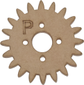                  |
|  5   |  6812 RGB Module                                                    | 1        |                                                                                                                    |
| 6    | Analog Gas Sensor                                                   | 1        |                                                                                                                    |
|  7   |  130 Motor Module                                                   |  1       |                                                                                                                 |
|  8   |  Steam Sensor                                                       | 1        |                                                                                                                    |
|  9   | DHT11 Temperature and Humidity Sensor                               | 1        |                                                                                                                     |
|  10  |  PIR Motion Sensor                                                  | 1        |                                                                                                                    |
|  11  |  Yellow LED Module                                                  | 1        |                                                                                                                    |
|   12 | Rechargeable Lithium Battery Power Module with Solar and USB Ports  | 1        | 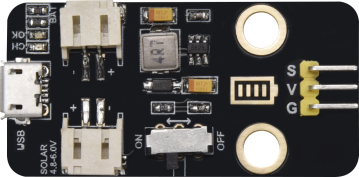                                                                                                                   |
| 13   | Battery Holder                                                      | 1        |                                                                                                                    |
| 14   | Micro:bit Solar Energy Panel                                        | 1        |                                                                                                                    |
| 15   | Servo                                                               | 2        |                                                                                                               |
| 16   | I2C 1602 LCD Module                                                 | 1        | 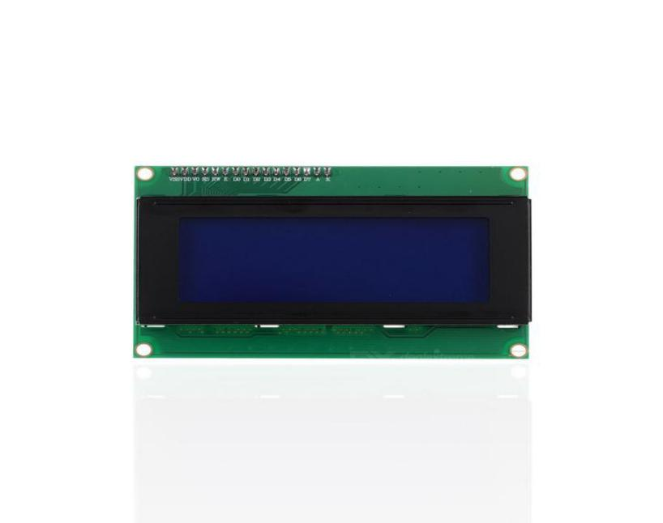                                                                                                          |
| 17   | Rocker Switch                                                       | 1        |                                                                                                                |
| 18   | 15cm 3Pin F-F DuPont Wire                                           | 4        |      |
| 19   | 20cm 3Pin F-F DuPont Wire                                           | 2        |      |
| 20   | 20cm F-F DuPont Wire                                                | 4        |                                                                                                                    |
| 21   | 20cm 4Pin F-F DuPont Wire                                           | 1        |  |
| 22   | 200mm 2Pin DuPont Wire                                              | 2        |                                                                                                                    |
| 23   | M2\*8MM Round-head Screw                                            | 3        |                                                                                                       |
| 24   | M1.4\*6MM Round-head Self-tapping Screw                             | 10       |                                                                                                       |
| 25   | M3 Nickel-plated Self-locking Nut                                   | 5        |                                                                                                                      |
| 26   | M4\*8MM Round-head Screw                                            | 18       |                                                                                                       |
| 27   | M3\*6MM Round-head Screw                                            | 9        |                                                                                                       |
| 28   | M3\*10MM Round-head Screw                                           | 9        |                                                                                                       |
| 29   | M2\*12MM Round-head Screw                                           | 5        |                                                                                                       |
| 30   | M4 Nickel-plated Nut                                                | 18       |                                                                                                                |
| 31   | M3 Nickel-plated Nut                                                | 6        |                                                                                                                |
| 32   | M2 Nickel-plated Nut                                                | 7        |                                                                                                                |
| 33   | M3\*8MM Round-head Screw                                            | 2        |                                                                                                           |
| 34   | Wrench                                                              | 1        | 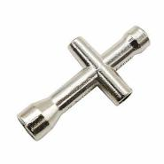                                                               |
| 35   | 3.0\*40MM Screwdriver Red-Black                                     | 1        |                                                                                                                      |
| 36   | 2.0\*40MM Screwdriver Purple-Black                                  | 1        |                                                                                                                |
| 37   | M3\*45MM Dual-pass Copper Pillar                                    | 4        |                                                                                                             |
| 38   | USB Cable AM/MK5P(micro) Black OD：3.5 L=1M PVC                     | 1        |                                                                                                              |
| 39   |  F5 Blue to Blue LED                                                | 2        |                                                                                                                  |
| 40   | 18650 Battery（Not Included）                                       | 1        |                                                                                                                      |

# Preparations:

1.  **Background Information about Micro:bit**

**( 1 )What is Micro:bit?**

Micro:bit is an open source hardware platform based on the ARM architecture
launched by British Broadcasting Corporation (BBC) together with ARM, Barclays,
element14, Microsoft and other institutions. The core device is a 32-bit Arm
Cortex-M4 with FPU micro-processing.

Though it is just the size of a credit card, the Micro:bit main board is
equipped with loads of components,including a 5\*5 LED dot matrix, 2
programmable buttons, an accelerometer, a compass, a thermometer, a
touch-sensitive logo and a MEMS microphone, a Bluetooth module of low energy,
and a buzzer and others. Thus, it also boasts multiple functions.

The buzzer built in the other side of the board makes playing all kinds of sound
possible without any external equipment. The golden fingers and gears added
provide a better fixing of crocodile clips. Moreover, this board has a sleeping
mode to lower power consumption of batteries and it can be entered if users long
press the Reset & Power button on the back of it. It is capable of reading the
data of sensors, controlling servos and RGB lights and attaching with a shield
so as to connect with various sensors. It also supports a variety of codes and
graphical programming platforms, and is compatible with almost all PCs and
mobile devices. It has no need to install drivers. It is of high integration of
electronic modules, and has a serial port monitoring function for easy
debugging.

The board has found wild applications. It can be applied in programming video
games, making interactions between light and sound, controlling a robot,
conducting scientific experiments, developing wearable devices and make some
cool inventions like robots and musical instruments, basically everything
imaginable.

**( 2 )Layout**

For the Micro: Bit main board, pressing the Reset & Power button, it will reset
the board and rerun the program.If you hold it tight, the red LED will slowly
get darker.When the power indicator flickers into darkness, releasing the button
and your Micro: Bit board will enter sleep mode for power saving .This will make
the battery more durable. And you could press this button again to‘wake up’your
Micro:bit.

For more information,please resort to following links：

<https://tech.microbit.org/hardware/>

https://microbit.org/new-microbit/

https://www.microbit.org/get-started/user-guide/overview/

<https://microbit.org/get-started/user-guide/features-in-depth/>

**( 3 ) Pinout**

**The functions of pins:**

| GPIO                       | P0，P1，P2，P3，P4，P5，P6，P7，P8，P9，P10，P11，P12，P13，P14，P15，P16，P19，P20                |
|----------------------------|----------------------------------------------------------------------------------------------------|
| ADC/DAC                    | P0，P1，P2，P3，P4，P10                                                                            |
| IIC                        | P19（SCL），P20（SDA）                                                                             |
| SPI                        | P13（SCK），P14（MISO），P15（MOSI）                                                               |
| PWM（used frequently）     | P0，P1，P2，P3，P4，P10                                                                            |
| PWM（not frequently used） | P5、P6、P7、P8、P9、P11、P12、P13、P14、P15、P16、P19、P20                                         |
| Occupied                   | P3(LED Col3)，P4(LED Col1)，P5(Button A)，P6(LED Col4)，P7(LED Col2)，P10(LED Col5)，P11(Button B) |

Browse the official website for more details:

<https://tech.microbit.org/hardware/edgeconnector/>

<https://microbit.org/guide/hardware/pins/>

**( 4 )Notes for the application of Micro:bit main board**

1.  It is recommended to cover it with a silicone protector to prevent short
    circuit for it has a lot of sophisticated electronic components.

1.  Its IO port is very weak in driving since it can merely handle current less
    than 300mA. Therefore, do not connect it with devices operating in large
    current, such as servo MG995 and DC motor or it will get burnt. Furthermore,
    you must figure out the current requirements of the devices before you use
    them and it is generally recommended to use the board together with a
    Micro:bit shield.

1.  It is recommended to power the main board via the USB interface or via the
    battery of 3V. The IO port of this board is 3V, so it does not support
    sensors of 5V. If you need to connect sensors of 5 V, a Micro: Bit expansion
    board is required.

1.  When using pins(P3, P4, P6, P7 and P10)shared with the LED dot matrix,
    blocking them from the matrix or the LEDs may display randomly and the data
    about sensors connected maybe wrong.

1.  Pin 19 and 20 can not be used as IO ports though the Makecode shows they
    can. They can only be used as I2C communication.

1.  The battery port of 3V cannot be connected with battery more than 3.3V or
    the main board will be damaged.

1.  Forbid to operate it on metal products to avoid short circuit.

To put it simple, Micro:bit V2 main board is like a microcomputer which has made
programming at our fingertips and enhanced digital innovation. And as for
programming environment, BBC provides a website: <https://microbit.org/code/,>
which has a graphical MakeCode program easy for use.

## 4.2.Install Micro:bit driver

Micro:bit is free of driver installation. However, in case your computer fail to
recognize the main board, you can install the diver too.

Just enter the link https://fs.keyestudio.com/KS4027-4028

to download the driver file  of
micro:bit in file folder .

**5.Getting Started with Micro:bit**

The following instructions are applied for Windows system but can also serve as
a reference if you are using a different system.

**5.1 Write code and program**

This chapter describes how to write program and load the program to the Micro:
Bit main board V2.

You are recommended to browse the official website of Micro:bit for more
details, and the link is attached below:

[https://microbit.org/guide/quick/](Https://microbit.org/guide/quick/)

**Step 1: connect the Micro: Bit main board with your computer**

Firstly, link the Micro: Bit main board with your computer via the USB cable.
Macs, PCs, Chromebooks and Linux（including Raspberry Pi）systems are all
compatible with the Micro: Bit main board.

Note that if you are about to pair the board with your phone or tablet, please
refer to this link:

[https:/microbit.org/get-started/user-guide/mobile/](https://microbit.org/get-started/user-guide/mobile/)

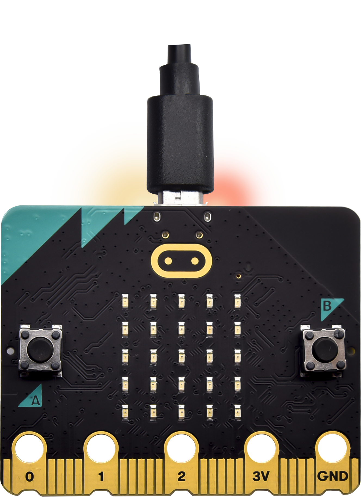

Secondly, if the red LED on the back of the board is on, that means the board is
powered. When your computer communicates with the main board via the USB cable,
the yellow LED on it will flashes. For example, it will flicker when you burn a
“hex”file.

Then Micro: bit main board will appear on your computer as a driver named
“MICROBIT(E:)”. Please note that it is not an ordinary USB disk as shown below.

**Step 2: write programs**

View the link <https://makecode.microbit.org/> in your browser;

Click ‘New Project’;

The dialog box‘Create a Project’ appears, fill it with‘heartbeat’and click
‘Create √’to edit.

(If you are running Windows 10 system, it is also viable to edit on the APP
MakeCode for micro:bit , which is exactly like editing in the website. And the
link to the APP is
[https://www.microsoft.com/zh-cn/p/makecode-for-micro-bit/9pjc7sv48lcx?ocid=badgep&rtc=1&activetab=pivot:overviewtab](https://www.microsoft.com/zh-cn/p/makecode-for-micro-bit/9pjc7sv48lcx?ocid=badgep&rtc=1#activetab=pivot:overviewtab)
)

Take Google Chrome as an example as shown below and it is almost the same for
other browsers.

Write a set of micro:bit code. You can drag some modules in the Blocks to the
editing area and then run your program in Simulator of MakeCode editor as shown
in the picture below which demonstrates how to edit ‘heartbeat’ program .

The path to the demonstration video:

.../2. Makecode Tutorial\\Makecode Code\\Project Code/Project 1：Heart beat

The next chapter will illustrate more details about Makecode.

Click the arrow behind “JS JavaScript”to choose between“JavaScript”or
“Python”and you will find the corresponding program in JavaScript language or
Python language as shown below:

**Step 3: download code**

If your computer is Windows 10 and you have downloaded the APP MakeCode for
micro:bit to write program, what you will have to do to download the program to
your Micro: Bit main board is merely clicking the ‘Download’ button, then all is
done.

If you are writing program through the website, following these steps:

Click the ‘Download’ in the editor to download a "hex" file, which is a compact
program format that the Micro: Bit main board can read. Once the hexadecimal
file is downloaded, copy it to your board just like the process that you copy
the file to the USB driver. If you are running Windows system, you can also
right-click and select ‘Send to → MICROBIT(E:) ‘to copy the hex file to the
Micro: Bit main board.

You can also directly drag the "hex" file onto the MICROBIT (E:) disk.

During the process of copying the downloaded hex file to the Micro: bit main
board, the yellow signal light on the back side of the board flashes. When the
copy is completed, the yellow signal light will stop flashing and remain on.

**Step 4: run the program：**

After the program is uploaded to the Micro: bit main board, you could still
power it via the USB cable or change to via an external power. The 5 x 5 LED dot
matrix on the board displays the heartbeat pattern.

|  |  |
|--------------------------------------------------|--------------------------------------------------|
| Power via USB cable                              | Power via external power (3V)                    |

**Caution:**

When you programs each time, the driver of Micro: bit will automatically eject
and return and your hexadecimal files will disappear . And the board can only
have access to hexadecimal files (hex) and save no other files.

**Step 5：about other programming languages**

This chapter has described how to use the Micro:bit main board.

But except for the Makecode graphical programming introduced you can also write
Micro:bit programs in other languages. Go to the link:
<https://microbit.org/code/> to know about other programming languages , or view
the link: <https://microbit.org/projects/>, to find something you want to have a
go.

## 5.2.Makecode：

Browse <https://makecode.microbit.org/> and enter Makecode online editor or open
the APP MakeCode for micro:bit of Windows 10.

Click“New Project”, and input“heartbeat”, then click “create √”to enter Makecode
editor, as shown below:

There are blocks“on start”and“forever”in the code editing area.

When the power is plugged or reset,“on start”means that the code in the block
only executes once, while“forever”implies that the code runs cyclically.

## 5.3 Quick Download

As mentioned before, if your computer is Windows 10 and you have downloaded the
APP MakeCode for micro:bit to write programs, the program written can be quickly
downloaded to the Micro: Bit main board by selecting ‘Download’.

While it is a little more trickier if you are using a browser to enter Makecode.
However, if you use Google Chrome, suitable for Linux，macOS and Windows 10, the
process can be quicker too.

We use the webUSB function of Chrome to allow the internet page to access the
hardware device connected USB.

You could refer to the following steps to connect and pair devices.

**Device pairing:**

Connect micro:bit to your computer by USB cable.

Click“...”beside“Download”and tap“Connect device”;

Click“Next”;

Click another“Next”;

Then select the corresponding device and click“Connect”. If no devices shows up
for selection, please refer to:

[https://makecode.microbit.org/device/usb/webusb/troubleshoot](https://makecode.microbit.org/device/usb/webusb/troubleshoot%20)

And for updating the firmware of the Micro:bit:
[https://microbit.org/guide/firmware/](https://microbit.org/guide/firmware/%20)
.

If the links are too troublesome for you , then you can also turn to our
‘Troubleshooting Downloads with WebUSB’and“upload the firmware”in the folder we
provided in the link:

https://fs.keyestudio.com/KS4027-4028

Click“Done”to finish the pairing.

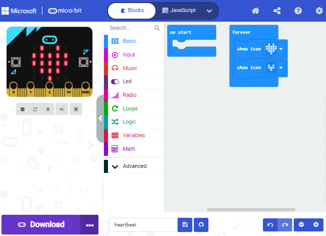

**Download program:**

After the pairing, click “download”to directly download the program to the
board. If it is successfully downloaded, the icon
 will shift to
.

## 5.4.Makecode extension library:

For your convenience, we have made a makecode extension library for this smart
home kit.

**Add smart home extension library:**

Please follow the following steps to add extension files:

Open Makecode to enter a certain project→click the gear-shaped icon(for setting)
in the upper right corner→choose “Extensions”;

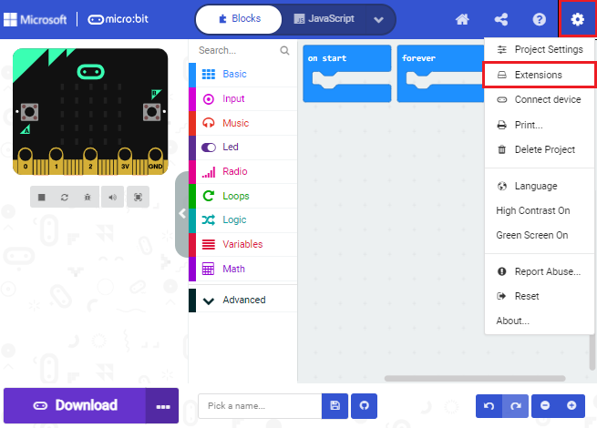

Or click”Advanced”to select “Extensions”as shown below:

Input the link <https://github.com/keyestudio2019/ks_IoT> to search;

Tap the searching result “IoT_keyestudio” to download and install it;

This process may take a few seconds.

After the installation, you can find the extension files DHT11/DHT22 and
I2C_LCD1602 on the left side.

And extension file Neopixel is also installed.

Note: the extension files added are only available for this project. Therefore,
when you create a new **IoT_keyestudio** project, you will need to add these
extension files again.

**Update or delete the IoT_keyestudio extension files:**

Please follow the following steps to update or delete extension files:

Click "Js JavaScript" to change to textual version:

Click the “Explorer”on the left side:

You can find these added files in the list;

Click the dustbin icon beside the file to delete the corresponding file;

Tap the refresh icon to update the corresponding IoT_keyestudio extension file.

## 5.4.Resources and test code

We also provide a link：https://fs.keyestudio.com/KS4027-4028

containing the information of the product from relevant tools to test codes,
tutorials and troubleshooting methods as well, as shown in the figure below:

## 5.5.Input test code

We provide hexadecimal code files (project files) for each project. The file
contains all the contents of the project and can be imported directly, or you
can manually drag the code blocks to complete the program for each project. For
simple projects, dragging a block of code to complete the program is
recommended.For complex projects, it is recommended to conduct the program by
importing the hexadecimal code file we provide.

Let's take the "Heatbeat" project as an example to show how to load the code.

Open the Web version of Makecode or the Windows 10 App version of Makecode;

Click“Import File”;

Select“../Makecode Code/Project 1\_ Heart beat/Project 1\_ Heart beat.hex”

Then click “Go ahead”.

In addition to importing the test code file provided into the Makecode compiler
above, you can also drag the the test code file provided into the code editing
area of the Makecode compiler, as shown in the figure below:

After a few seconds, it is done.

Note: if your computer system is Windows7 or 8 instead of Windows 10, the
pairing cannot be done via Google Chrome. Therefore, digital signal or analog
signal of sensors and modules cannot be shown on the serial port simulator.
However, you need to read the corresponding digital signal or analog signal.So
what can we do? You can use the CoolTerm software to read the serial port data
of the microbit. Next chapter is about how to install CoolTerm.

## 5.6. Install CoolTerm：

CoolTerm program is used to read the data on serial port.

Download CoolTerm program:

<https://freeware.the-meiers.org/>

After the download, we need to install CoolTerm program file, below is PC Window
system taken as an example.

1.  Choose“win”to download the zip file of CoolTerm

2.  Unzip file and open it. (also suitable for Mac and Linux system)

1.  Double-click.（please make
    sure that the driver of Micro:bit is installed and the main board is
    connected with the computer.)

The functions of each button on the Toolbar are listed below:
<http://wiki.keyestudio.com/index.php/File:IDE.png>

|         | Open up a new Terminal                           |
|--------------------------------------------------------|--------------------------------------------------|
|         | Open a saved Connection                          |
|         |  Save the current Connection to disk             |
|  | Open the Serial Connection                       |
|  | Close the Serial Connection                      |
|  | Clear the Received Data                          |
|  | Open the Connection Options Dialog               |
|  | Display the Terminal Data in Hexadecimal Format  |
|         | Display the Help Window                          |

6.Install the Smart Home

| **Part 1**                                               |                                                                                                                                                                                                                                                                                                        |        |
|----------------------------------------------------------|--------------------------------------------------------------------------------------------------------------------------------------------------------------------------------------------------------------------------------------------------------------------------------------------------------|--------|
|  Components Needed                                       |                                                                                                                                   |        |
|  Installation Diagram                                    |                                                                                                                           |        |
|  Prototype                                               |  （wire up the 1602 LCD, as shown below）  |        |
| **Part 2**                                               |                                                                                                                                                                                                                                                                                                        |        |
|   Components Needed                                      |                                                                                                                                   |        |
|    Installation Diagram                                  | 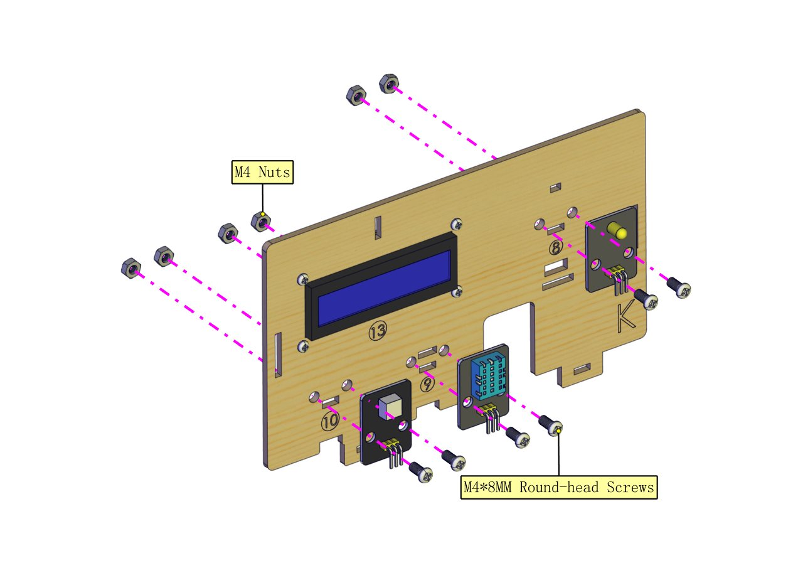                                                                                                                          |        |
|    Prototype                                             |                                                                                                                           |        |
| **Part 3**                                               |                                                                                                                                                                                                                                                                                                        |        |
|  Components Needed                                       |                                                                                                                                   |        |
|   Installation Diagram                                   |                                                                                                                           |        |
|   Prototype                                              |                                                                                                                           |        |
| Adjust the angle of the servo controlling windows to 0°  | **Wiring：** Micro:bit Expansion Board                                                                                                                                                                                                                                                                 | Servo  |
| GND                                                      | Brown Wire                                                                                                                                                                                                                                                                                             |        |
| 5V                                                       | Red Wire                                                                                                                                                                                                                                                                                               |        |
| S（9）                                                   | Orange Wire                                                                                                                                                                                                                                                                                            |        |

Connect the main board with the shield and with the computer via USB cable;

Plug them up;

Turn the slide switch on the board to the “ON”end, and the rocker switch to the
“1”end.

**Example code：**

After uploading the example code to Micro:bit, the angle of the servo is set to
0°.

**Part 4**

Components Needed (peel the sticker off the gear-shaped Acrylic board first)

Installation Diagram

Prototype

**Part 5**

Components Needed

Installation Diagram

Prototype

**Part 6**

Components Needed

(peel the sticker off the Acrylic board first)

Installation Diagram

(The gears of the N Board should be properly jointed with the wooden gear and do
not fix the self-locking nut tight; after installation, the door is closed.）

Prototype

**Part 7**

Components Needed

Installation Diagram

Prototype

**Part 8**

Components Needed

Installation Diagram

Prototype

**Part 9**

Components Needed

Installation Diagram

Prototype

**Part 10**

Components Needed

Installation Diagram

(stick the solar panel along the right side of the line marked in the picture;
pull the wires on the panel out from the hole in the middle.)

Prototype

**Part 11**

Components Needed

Installation Diagram

Prototype

**Part 12**

Components Needed

Installation Diagram

Prototype

**Part 13**

Components Needed

Installation Diagram

Prototype

**Part 14**

Components Needed

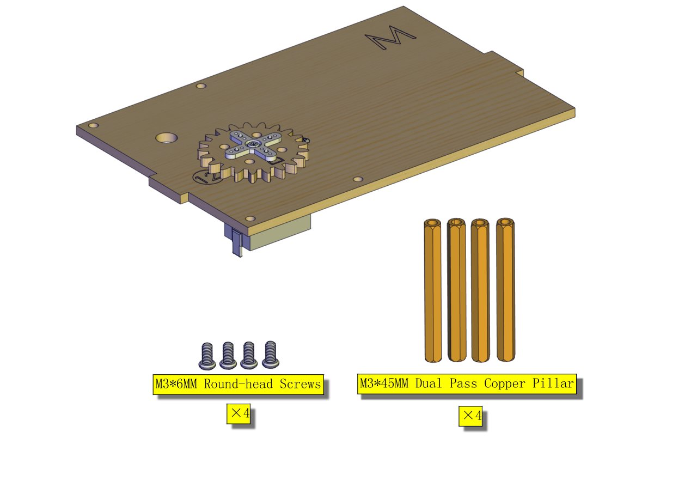

Installation Diagram

Prototype

**Part 15**

Components Needed

Installation Diagram

Prototype

**Part 16**

Components Needed

Installation Diagram

Prototype

**Part 17**

Component Needed

Installation Diagram

Prototype

**Part 18**

Components Needed

Installation Diagram

Prototype

**Part 19**

Components Needed

(peel the sticker off the Acrylic board first)

Installation Diagram

Prototype

**Part 20**

Components Needed

Installation Diagram

Prototype

**Part 21**

Components Needed

Installation Diagram

Prototype

**Start Wiring**

The wiring of the battery holder

(plug its jack to the BAT end of the rechargeable power module)

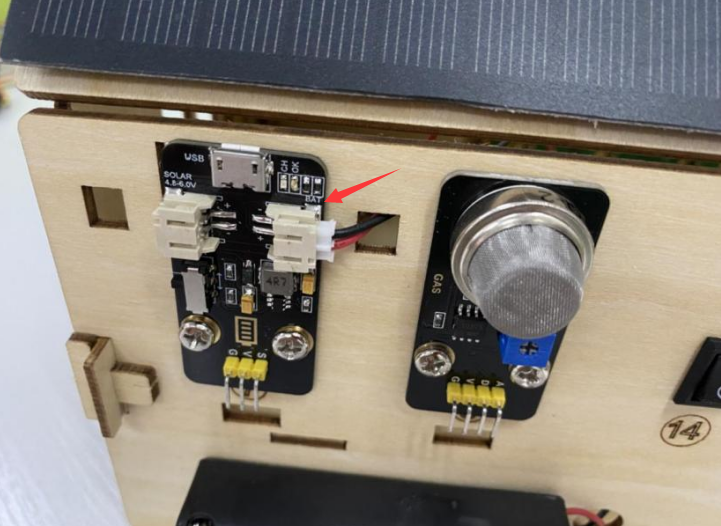

The wiring of the yellow LED

The wiring of the RGB module

The wiring of the PIR motion sensor

Use the longer Dupont wire

The wiring of the 1602LCD

The wiring of the analog gas sensor

The wiring of the humidity and temperature sensor

Use the longer Dupont wire

The wiring of the servo controlling the door

The wiring of the servo controlling the window

The wiring of the rechargeable lithium battery power module (Connect the shield
with it; attach the red wire to V and the black one to G.）

The wiring of the solar panel

The wiring of the motor (Please pay attention to the pins and the connection
cannot be reversed.)

The wiring of the steam sensor

(Connect it to the P0 of 3.3V or the analog value can not be read.)

**Mount the Roof**

Components Needed

Installation Diagram

Prototype

Installation Diagram

Prototype

Install Micro:bit main board

Prototype

# Project：

## Project 1: Heartbeat

1.  **Project Introduction**

This project is easy to conduct with a micro:bit main board, a Micro USB cable
and a computer. The micro:bit LED dot matrix will display a relatively big
heart-shaped pattern and then a smaller one. This alternative change of this
pattern is like heart beating. This experiment serves as a starter for your
entry to the programming world.

**(2)Components Needed:**

|  |   |
|-----------------------------------------------------|----------------------------------------------------|
| Micro:bit main board \*1                            | USB cable\*1                                       |

**(3)Connection Diagram:**

Attach the Micro:bit main board to your computer via the USB cable.

**(4)Test Code:**

The route to get test codes（[How to load?](#_5.5.导入代码：)）

| File Type | Path                                                                             | File Name                 |
|-----------|----------------------------------------------------------------------------------|---------------------------|
| Hex file  | KS4027 folder/Makecode Tutorial/Makecode Code/Project Code/Project 1：Heart beat | Project 1：Heart beat.hex |

You can also drag blocks to form code. No need to worry though you are not good
at programming.

Firstly, you can view this link
[https://makecode.micro:bit.org/reference](https://makecode.microbit.org/reference)
to find more information about micro: bit blocks. Then this link
[https://makecode.micro:bit.org/](https://makecode.microbit.org/) can help you
write code.

**Command blocks can be found on the right:**

Make combinations of these blocks:

Click the arrow behind“JS JavaScript”to select between“JavaScript”and “Python”to
show the code in JavaScript language or Python language:

**(5)Test Results:**

After uploading test code to micro:bit main board and keeping the connection
with the computer to power the main board, the LED dot matrix shows
pattern“”and
then“”alternatively.

( Please refer to chapter 5.3 to know how to download test code quickly.)

If the downloading is not smooth, please remove the USB cable from the main
board and then reconnect them and reopen Makecode to try again.

**Project 2: Light A Single LED**

1.  **Project Introduction**

In this project, we intend to control a certain LED of the micro:bit main board
to shine.

**(2)Components Needed:**

|  |   |
|-----------------------------------------------------|----------------------------------------------------|
| Micro:bit main board \*1                            | USB cable\*1                                       |

**(3)Connection Diagram:**

Attach the Micro:bit main board to your computer via the USB cable.

**(4)Introduction of components:**

The LED dot matrix consists of 25 LEDs arranged in a 5 by 5 square. In order to
locate these LEDs quickly, as the figure shown below, we can regarded this
matrix as a coordinate system and create two aces by marking those in rows from
0 to 4 from top to bottom, and the ones in columns from 0 to 4 from the left to
the right. Therefore, the LED sat in the second of the first line is (1,0）and
the LED positioned in the fifth of the fourth column is (3,4）and others
likewise.

**(5)Test Code:**

The route to get test codes（[How to load?](#_5.5.导入代码：)）

| File Type | Route                                                                                    | File Name                         |
|-----------|------------------------------------------------------------------------------------------|-----------------------------------|
| Hex file  | KS4027 folder/Makecode Tutorial/Makecode Code/Project Code/Project 2：Light A Single LED | Project 2：Light A Single LED.hex |

You can also drag blocks to form code.

Command blocks can be found on the right as shown below:

Make combinations of these blocks:

**(6)Test Result**

After uploading test code to micro:bit main board and powering the main board
via the USB cable, the LED in (1,0) lights up for 1s and the one in (3,4) shines
for 1s and repeat this sequence.

**Project 3: LED Dot Matrix**

1.  **Project Introduction**

Dot matrices are very commonplace in daily life. They have found wide
applications in LED advertisement screens, elevator floor display, bus stop
announcement and so on.

The LED dot matrix of Micro: Bit main board contains 25 LEDs in a grid.
Previously, we have succeeded in controlling a certain LED to light by
integrating its position value into the test code. Supported by the same theory,
we can turn on many LEDs at the same time to showcase patterns, digits and
characters.

What’s more, we can also click”show icon“ to choose the pattern we like to
display. Last but not the least, we can design patterns by ourselves as well.

**(2)Components Needed:**

|  |   |
|-----------------------------------------------------|----------------------------------------------------|
| Micro:bit main board \*1                            | USB cable\*1                                       |

**(3)Connection Diagram:**

Attach the Micro:bit main board to your computer via the Micro USB cable.

**(4)Test Code:**

The route to get test codes（[How to load?](#_5.5.导入代码：)）

| File Type | Route                                                                                | File Name                     |
|-----------|--------------------------------------------------------------------------------------|-------------------------------|
| Hex file  | KS4027 folder/Makecode Tutorial/Makecode Code/Project Code/Project 3：LED Dot Matrix | Project 3：LED Dot Matrix.hex |

You can also drag blocks to form code.

Command blocks can be found on the right as shown below:

Make combinations of these blocks:

**(5)Test Result:**

After uploading test code to micro:bit main board and powering the main board
via the USB cable, we find that the 5\*5 dot matrix start to show numbers
1,2,3,4 and 5, and then it alternatively shows a downward arrow
, word “Hello”, a heart pattern
, an arrow pointing at northeast
, then at southeast
, then at southwest
, and then at northwest
.

**Project 4: Programmable Buttons**

1.  **Project Introduction**

Buttons can be used to control circuits. In an integrated circuit with a push
button, the circuit is connected when pressing the button and it is open the
other way around.

Micro: Bit main board boasts three push buttons, two are programmable
buttons(marked with A and B), and the one on the other side is a reset button.
By pressing the two programmable buttons can input three different signals. We
can press button A or B alone or press them together and the LED dot matrix
shows A,B and AB respectively. Let’s get started.

1.  **Components Needed:**

|  |   |
|-----------------------------------------------------|----------------------------------------------------|
| Micro:bit main board \*1                            | USB cable\*1                                       |

**(3)Connection Diagram:**

Attach the Micro:bit main board to your computer via the USB cable.

**(4)Test Code 1:**

The route to get test codes（[How to load?](#_5.5.导入代码：)）

| File Type | Route                                                                                      | File Name             |
|-----------|--------------------------------------------------------------------------------------------|-----------------------|
| Hex file  | KS4027 folder/Makecode Tutorial/Makecode Code/Project Code/Project 4：Programmable Buttons | Project 4：Code-1.hex |

You can also drag blocks to form code.

Command blocks can be found on the right as shown below:

Make combinations of these blocks:

**(5)Test Result 1:**

After uploading test code to micro:bit main board and powering the main board
via the USB cable, the 5\*5 LED dot matrix shows A if button A is pressed and
then released, B if button B pressed and released, and AB if button A and B
pressed together and then released.

**(6)Test Code 2:**

The route to get test codes（[How to load?](#_5.5.导入代码：)）

| File Type | Route                                                                                      | File Name             |
|-----------|--------------------------------------------------------------------------------------------|-----------------------|
| Hex file  | KS4027 folder/Makecode Tutorial/Makecode Code/Project Code/Project 4：Programmable Buttons | Project 4：Code-2.hex |

You can also drag blocks to form code.

Command blocks can be found on the right as shown below:

Make combinations of these blocks:

**(7)Test Result 2:**

After uploading test code to micro:bit main board and powering the main board
via the USB cable, when the button A is pressed, the LEDs turning red increase
while when the button B pressed, the LEDs turning red reduce.

**Project 5: Temperature Detection**

1.  **Project Introduction**

The Micro:bit main board is not equipped with a temperature sensor, but uses the
temperature sensor built into NFR52833 chip for temperature detection.
Therefore, the detected temperature is more closer to the temperature of the
chip, and there maybe deviation from the ambient temperature. The sensor can
detect temperature of external environment with the range of 40℃\~105℃.

1.  **Components Needed:**

|  |   |
|-----------------------------------------------------|----------------------------------------------------|
| Micro:bit main board \*1                            | USB cable\*1                                       |

**(3)Connection Diagram:**

Attach the Micro:bit main board to your computer via the USB cable.

**(4)Test Code 1:**

The route to get test codes（[How to load?](#_5.5.导入代码：)）

| File Type | Route                                                                                       | File Name             |
|-----------|---------------------------------------------------------------------------------------------|-----------------------|
| Hex file  | KS4027 folder/Makecode Tutorial/Makecode Code/Project Code/Project 5：Temperature Detection | Project 5：Code-1.hex |

You can also drag blocks to form code.

Command blocks can be found on the right as shown below:

Make combinations of these blocks:

**(5)Test Result 1：**

After uploading test code 1 to micro:bit main board, powering the main board via
the USB cable, and clicking“Show console Device”, the data of temperature shows
in the serial monitor page as shown below.

When you touch the processor nNRF52833 on the board for a while, its temperature
will rise gradually and the CoolTerm serial monitor will show the change of
temperature in the current environment, as shown in the figures below :

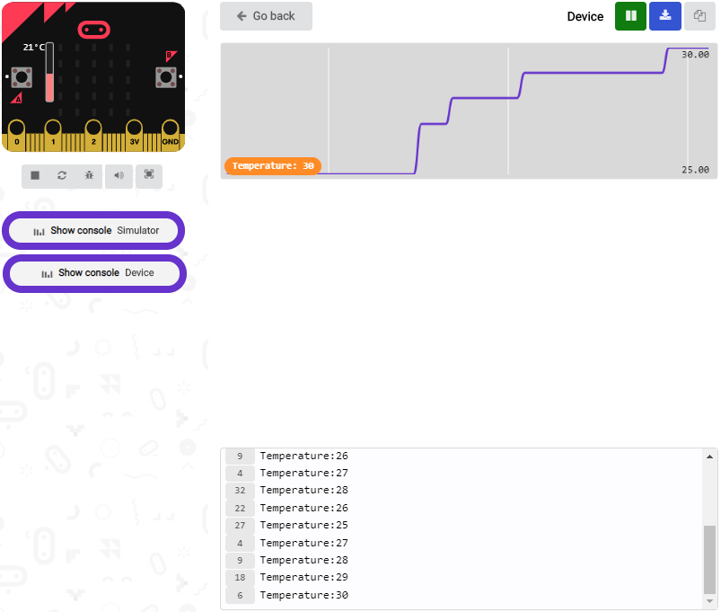

If you're running Windows 7 or 8 instead of Windows 10, via Google Chrome won't
be able to match devices. You'll need to use the CoolTerm serial monitor
software to read data.

You could open CoolTerm software, click Options, select SerialPort, set COM port
and put baud rate to 115200 (after testing, the baud rate of USB SerialPort
communication on Micro: Bit main board is 115200), click OK, and Connect. The
CoolTerm serial monitor shows the change of temperature in the current
environment, as shown in the figures below :

**(6)Test Code 2:**

The route to get test codes（[How to load?](#_5.5.导入代码：)）

| File Type | Route                                                                                       | File Name             |
|-----------|---------------------------------------------------------------------------------------------|-----------------------|
| Hex file  | KS4027 folder/Makecode Tutorial/Makecode Code/Project Code/Project 5: Temperature Detection | Project 5：Code-2.hex |

You can also drag blocks to form code.

Command blocks can be found on the right as shown below:

Make combinations of these blocks:

(Please note that the value 35 in the statement below can be changed according
to real situation.)

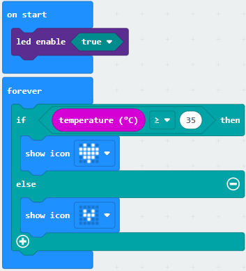

1.  **Test Result 2:**

After uploading the code 2 to the board, when the ambient temperature is less
than 35℃, the 5\*5 LED dot matrix shows
. When the temperature is
equivalent to or greater than 35℃, the
pattern appears.

**Project 6: Geomagnetic Sensor**

1.  **Project Introduction**

This project aims to explain the use of the Micro: bit geomagnetic sensor, which
can not only detect the strength of the geomagnetic field, but also be used as a
compass to find bearings. It is also an important part of the Attitude and
Heading Reference System (AHRS).

Micro: Bit main board uses LSM303AGR geomagnetic sensor, which supports four
modes namely 100 kHz,400 kHz,1 MHz and 3.4 MHz and the dynamic range of magnetic
field is ±50 gauss.

In the board, the magnetometer module is used in both magnetic detection and
compass. In this experiment, the compass will be introduced first, and then the
original data of the magnetometer will be checked.The main component of a common
compass is a magnetic needle, which can be rotated by the geomagnetic field and
point toward the geomagnetic North Pole (which is near the geographic South
Pole) to determine direction.

Attention: this geomagnetic sensor built in the board can help us determine
bearings by showing readings in the value from 0 to 360. And the system will ask
us to calibrate it the first time it is put into operation by rotating the
board.Please note that metal materials around may attenuate the accuracy of the
reading and calibration.

**(2)Components Needed:**

|  |   |
|-----------------------------------------------------|----------------------------------------------------|
| Micro:bit main board \*1                            | USB cable\*1                                       |

**(3)Connection Diagram:**

Attach the Micro:bit main board to your computer via the USB cable.

**(4)Test Code 1:**

The route to get test codes（[How to load?](#_5.5.导入代码：)）

| File Type | Route                                                                                    | File Name             |
|-----------|------------------------------------------------------------------------------------------|-----------------------|
| Hex file  | KS4027 folder/Makecode Tutorial/Makecode Code/Project Code/Project 6：Geomagnetic Sensor | Project 6：Code-1.hex |

You can also drag blocks to form code.

Command blocks can be found on the right as shown below:

Make combinations of these blocks:

Note: it is imperative to calibrate the Micro:bit board for different
geomagnetic fields existing in different places. And the system will make an
automatic requirement if it is used for the first time.

**(5)Test Result1：**

After uploading Test Code 1 to micro:bit main board and powering the board via
the USB cable, and pressing the button A, the board asks us to calibrate compass
and the LED dot matrix shows “TILT TO FILL SCREEN”. Then enter the calibration
page. Rotate the board until all 25 red LEDs are on as shown below.

After that, a smile pattern
 appears, which implies
the calibration is done. When the calibration process is completed, pressing the
button A will make the magnetometer reading display directly on the screen. And
the direction north, east, south and west correspond to 0°, 90°, 180° and 270°
respectively.

**(6)Test Code 2:**

The route to get test codes（[How to load?](#_5.5.导入代码：)）

| File Type | Route                                                                                        | File Name             |
|-----------|----------------------------------------------------------------------------------------------|-----------------------|
| Hex file  | KS4027 folder/Makecode Tutorial/Makecode Tutorial/Project Code/Project 6: Geomagnetic Sensor | Project 6：Code-2.hex |

This module can keep reading data to determine direction, so does point to the
current magnetic North Pole by arrow.

For the above picture, the arrow pointing to the upper right when the value
ranges from 292.5 to 337.5. Because 0.5 can’t be input in the code, the values
we get are 293 and 338.

Then add other statements to make a set of complete code.

You can also drag blocks to form code.

Command blocks can be found on the right as shown below:

Make combinations of these blocks:

**(7)Test Result 2:**

Upload code 2 and plug micro:bit into power. After calibration, tilt micro:bit
board, and the LED dot matrix displays the direction signs.

**Project 7: Accelerometer**

1.  **Project Introduction**

The Micro: Bit main board V2 has a built-in LSM303AGR gravity acceleration
sensor, also known as accelerometer, with a resolution of 8/10/12 bits. The code
section sets the range to 1g, 2g, 4g, and 8g.

We often use accelerometer to detect the status of machines.

In this project, we will introduce how to measure the position of the board with
the accelerometer. And then have a look at the original three-axis data output
by the accelerometer.

1.  **Components Needed:**

|  |   |
|-----------------------------------------------------|----------------------------------------------------|
| Micro:bit main board \*1                            | USB cable\*1                                       |

**(3)Connection Diagram:**

Attach the Micro:bit main
board to your computer via the USB cable.

**(4)Test Code 1:**

The route to get test codes（[How to load?](#_5.5.导入代码：)）

| File Type | Route                                                                                | File Name             |
|-----------|--------------------------------------------------------------------------------------|-----------------------|
| Hex file  | KS4027 folder/Makecode Tutorial/Makecode Code/Project Code/Project 7：Accelerometer  | Project 7：Code-1.hex |

You can also drag blocks to form code.

Command blocks can be found on the right as shown below:

Make combinations of these blocks:

**(5)Test Result 1：**

After uploading the test code 1 to micro:bit main board and powering the board
via the USB cable, if we shake the Micro: Bit main board，no matter at any
direction, the LED dot matrix displays the digit “1”.

When it is kept upright （make its logo above the LED dot matrix）, the number 2
shows.

When it is kept upside down( make its logo below the LED dot matrix) , it shows
as below.

When it is placed still on the desk, showing its front side, the number 4
appears.

When it is placed still on the desk, showing its back side, the number 5
exhibits.

When the board is tilted to the left , the LED dot matrix shows the number 6 as
shown below.

When the board is tilted to the right , the LED dot matrix displays the number 7
as shown below：

When the board is knocked to the floor, this process can be considered as a free
fall and the LED dot matrix shows the number 8. (Please note that this test is
not recommended for it may damage the main board.)

Attention: if you’d like to try this function, you can also set the acceleration
to 3g, 6g or 8g. But still ,we do not recommend.

1.  **Test Code 2：**

The route to get test codes（[How to load?](#_5.5.导入代码：)）

| File Type | Route                                                                               | File Name             |
|-----------|-------------------------------------------------------------------------------------|-----------------------|
| Hex file  | KS4027 folder/Makecode Tutorial/Makecode Code/Project Code/Project 7：Accelerometer | Project 7：Code-2.hex |

You can edit command blocks yourself

**Command blocks:**

Make combinations of these blocks:

**(7)Test Result 2:**

Upload test code to micro:bit main board, power the main board via the USB
cable, and click “Show console Device”.

After referring to the MMA8653FC data manual and the hardware schematic diagram
of the Micro: Bit main board, the accelerometer coordinate of the Micro: Bit are
shown in the figure below:

The following interface shows the decomposition value of acceleration in X axis,
Y axis and Z axis respectively, as well as acceleration synthesis (acceleration
synthesis of gravity and other external forces).

If you're running Windows 7 or 8 instead of Windows 10, via Google Chrome won't
be able to match devices. You'll need to use the CoolTerm serial monitor
software to read data.

You could open CoolTerm software, click Options, select SerialPort, set COM port
and put baud rate to 115200 (after testing, the baud rate of USB SerialPort
communication on Micro: Bit main board is 115200), click OK, and Connect. The
CoolTerm serial monitor shows the data of X axis, Y axis and Z axis , as shown
in the figures below :

**Project 8: Light Brightness Detection**

1.  **Project Introduction**

In this project, we focus on the light detection function of the Micro: Bit main
board V2. It is achieved by the LED dot matrix. And it can be viewed as a
photosensor.

**(2)Components Needed:**

|  |   |
|-----------------------------------------------------|----------------------------------------------------|
| Micro:bit main board \*1                            | USB cable\*1                                       |

**(3)Connection Diagram:**

Attach the Micro:bit main board to your computer via the USB cable.

**(4)Test Code:**

The route to get test codes（[How to load?](#_5.5.导入代码：)）

| File Type | Route                                                                                            | File Name                                 |
|-----------|--------------------------------------------------------------------------------------------------|-------------------------------------------|
| Hex file  | KS4027 folder/Makecode Tutorial/Makecode Code/Project Code/Project 8：Light Brightness Detection | Project 8：Light Brightness Detection.hex |

You can also drag blocks to form code.

Command blocks can be found on the right as shown below:

Make combinations of these blocks:

**(5)Test Result:**

Upload the test code to micro:bit main board, power the board via the USB cable
and click“Show console Device”.

When the LED dot matrix is covered by hand, the light intensity showed is
approximately 0; when the LED dot matrix is exposed to light,the light intensity
displayed gets stronger with the light as shown below:

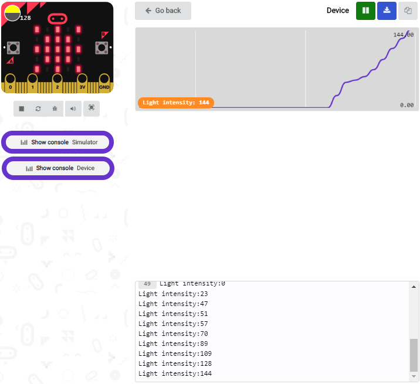

The 20 in the code is an arbitrary value of light intensity. If the current
light level is less than or equal to 20, the icon moon will appear on the LED
dot matrix. If it's bigger than 20, the sun will appear.

If you're running Windows 7 or 8 instead of Windows 10, via Google Chrome won't
be able to match devices. You'll need to use the CoolTerm serial monitor
software to read data.

You could open CoolTerm software, click Options, select SerialPort, set COM port
and baud rate to 115200 (after testing, the baud rate of USB SerialPort
communication on Micro: Bit main board is 115200), click OK, and Connect. The
CoolTerm serial monitor shows the value of light intensity , as shown in the
figures below :

**Project 9: Speaker**

1.  **Project Introduction**

Micro: Bit main board has an built-in speaker, which makes adding sound to the
programs easier. With a speaker, all Micro:bit board can be used to create
sound-related projects. But the new version, that’s the version 2 is able to
make the speaker utter giggles, greetings and yawning and sound sad. It can also
be programmed to air all kinds of tones, like playing the song *Ode to Joy.*

**(2)Components Needed:**

|  |   |
|-----------------------------------------------------|----------------------------------------------------|
| Micro:bit main board \*1                            | USB cable\*1                                       |

**(3)Connection Diagram:**

Attach the Micro:bit main board to your computer via the USB cable.

**(4)Test Code 1:**

The route to get test codes（[How to load?](#_5.5.导入代码：)）

| File Type | Route                                                                         | File Name             |
|-----------|-------------------------------------------------------------------------------|-----------------------|
| Hex file  | KS4027 folder/Makecode Tutorial/Makecode Code/Project Code/Project 9: Speaker | Project 9：Code-1.hex |

You can also drag blocks to form code.

Command blocks can be found on the right as shown below:

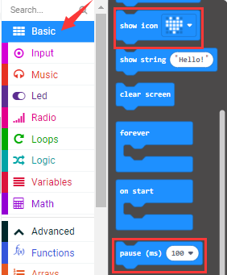

Make combinations of these blocks:

**(5)Test Result 1:**

After uploading the Test Code 1 to micro:bit main board and powering the board
via the USB cable, the speaker utters sound and the LED dot matrix shows the
logo of music.

**(6)Test Code 2:**

The route to get test codes（[How to load?](#_5.5.导入代码：)）

| File Type | Route                                                                         | File Name             |
|-----------|-------------------------------------------------------------------------------|-----------------------|
| Hex file  | KS4027 folder/Makecode Tutorial/Makecode Code/Project Code/Project 9：Speaker | Project 9：Code-2.hex |

You can also drag blocks to form code.

Command blocks can be found on the right as shown below:

Make combinations of these blocks:

The musical score of *Ode to Joy* is attached below:

Find more information about musical notations via this link:

https://en.wikipedia.org/wiki/Numbered_musical_notation

**(7) Test Result 2:**

After uploading the Test Code 2 to micro:bit main board and powering the board
via the USB cable, the speaker on built-in the Micro:bit board plays the sound
*Ode to Joy .*

## Project 10: Touch-sensitive Logo

1.  **Project Introduction**

The Micro: Bit main board is equipped with a golden touch-sensitive logo, which
can act as an input component and function like an extra button.

It contains a capacitive touch sensor that senses small changes in the electric
field when pressed (or touched), just like your phone or tablet screen do.When
you press it , you can activate the program.

**(2)Components Needed:**

|  |    |
|-----------------------------------------------------|-----------------------------------------------------|
| Micro:bit main board \*1                            | USB cable\*1                                        |

**(3)Connection Diagram:**

Attach the Micro:bit main board to your computer via the USB cable.

**(4)Test Code:**

The route to get test codes（[How to load?](#_5.5.导入代码：)）

| File Type | Route                                                                                       | File Name                            |
|-----------|---------------------------------------------------------------------------------------------|--------------------------------------|
| Hex file  | KS4027 folder/Makecode Tutorial/Makecode Code/Project Code/Project 10：Touch-sensitive Logo | Project 10：Touch-sensitive Logo.hex |

You can also drag blocks to form code.

Command blocks can be found on the right as shown below:

Make combinations of these blocks:

**(5)Test Results:**

After uploading the test code to micro:bit main board and powering the board via
the USB cable, the LED dot matrix exhibits the heart pattern when the
touch-sensitive logo is pressed or touched and displays digit when the logo is
released. The longer it is pressed, the bigger the number is when it is
released.

**Project 11: Microphone**

1.  **Project Introduction**

The Micro: Bit main board is built with a microphone which can test the volume
of ambient environment. When you clap, the microphone LED indicator turns on.
Since it can measure the intensity of sound, you can make a noise scale or disco
lighting changing with music. The microphone is placed on the opposite side of
the microphone LED indicator and in proximity with holes that lets sound
pass.When the board detects sound, the LED indicator lights up.

1.  **Components Needed:**

|  |   |
|-----------------------------------------------------|----------------------------------------------------|
| Micro:bit main board \*1                            | USB cable\*1                                       |

**(3)Connection Diagram:**

Attach the Micro:bit main board to your computer via the USB cable.

****

**(4)Test Code 1:**

The route to get test codes（[How to load?](#_5.5.导入代码：)）

| File Type | Route                                                                             | File Name              |
|-----------|-----------------------------------------------------------------------------------|------------------------|
| Hex file  | KS4027 folder/Makecode Tutorial/Makecode Code/Project Code/Project 11：Microphone | Project 11：Code-1.hex |

You can also drag blocks to form code.

Command blocks can be found on the right as shown below:

Make combinations of these blocks:

**(5)Test Result 1:**

After uploading test code to micro:bit main board and powering the board via the
USB cable, the LED dot matrix displays
pattern“”when you clap and
pattern  when it is quiet around.

**(6)Test Code 2:**

The route to get test codes（[How to load?](#_5.5.导入代码：)）

| File Type | Route                                                                             | File Name              |
|-----------|-----------------------------------------------------------------------------------|------------------------|
| Hex file  | KS4027 folder/Makecode Tutorial/Makecode Code/Project Code/Project 11: Microphone | Project 11: Code-2.hex |

You can also drag blocks to form code.

Command blocks can be found on the right as shown below:

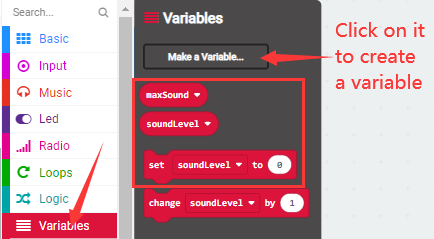

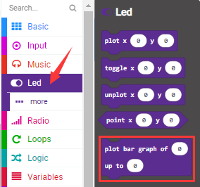

Make combinations of these blocks:

**(2)Test Result 2:**

Upload test code to micro:bit main board, power the board via the USB cable and
click “Show console Device”as shown below:

When the sound is louder around, the sound value shows in the serial port is
bigger as shown below:

What’s more, when the button A is pressed, the LED dot matrix displays the value
of the biggest volume( please note that the biggest volume can be reset via the
Reset button on the other side of the board ) while when clapping, the LED dot
matrix shows the pattern of the sound.

## Project 12: Play Music

1.  **Project Introduction**

In the previous projects, we have learned about the touch-sensitive logo and the
speaker respectively. In the project, we will combine these two components to
play music. That’s the logo will be applied to control the speaker to sing
songs.

**(2) Components Needed:**

|  |    |
|-----------------------------------------------------|-----------------------------------------------------|
| Micro:bit main board \*1                            | USB cable\*1                                        |

**(3)Connection Diagram:**

Attach the Micro:bit main
board to your computer via the USB cable.

**(4)Test Code:**

The route to get test codes（[How to load?](#_5.5.导入代码：)）

| File Type | Route                                                                             | File Name                  |
|-----------|-----------------------------------------------------------------------------------|----------------------------|
| Hex file  | KS4027 folder/Makecode Tutorial/Makecode Code/Project Code/Project 12: Play Music | Project 12：Play Music.hex |

You can also drag blocks to form code.

Command blocks can be found on the right as shown below:

Make combinations of these blocks:

**(5)Test Results:**

After uploading test code to micro:bit main board and powering the board via the
USB cable, the speaker plays the song *Happy Birthday to You* when the logo is
touched.

## Project 13: Dodge Bullets

1.  **Project Introduction**

In the previous projects, we have learned about the two programmable buttons,
button A and B, and the LED dot matrix respectively. In this one, we will
combine them to design a game- Dodge Bullets.

**(2)Components Needed:**

|  |    |
|-----------------------------------------------------|-----------------------------------------------------|
| Micro:bit main board \*1                            | USB cable\*1                                        |

**(3)Connection Diagram:**

Attach the Micro:bit main
board to your computer via the USB cable.

**(4)Game Rule1**

There are two bullets (marked as G1 and G2)falling from the LED dot matrix and a
role G on the bottom of the matrix. Button A and B can be used to control the
movement of the role to dodge bullets. It moves to the right when A is pressed
and to the left when B is pressed. The game is over when G is hit and the game
can start over by pressing A and B together.

**(5)Test Code 1:**

The route to get test codes（[How to load?](#_5.5.导入代码：)）

| File Type | Route                                                                                | File Name              |
|-----------|--------------------------------------------------------------------------------------|------------------------|
| Hex file  | KS4027 folder/Makecode Tutorial/Makecode Code/Project Code/Project 13：Dodge Bullets | Project 13：Code-1.hex |

You can also drag blocks to form code.

Command blocks can be found on the right as shown below:

Make combinations of these blocks:

1.  **Test Result 1:**

The game begins when the code is uploaded to the main board. The bullets G1 and
G2 fall off and the role G is controlled by Button A and B to shun them. If the
role fail to avert the attacks, the game is over.

**(7)Game Rule 2:**

Built on the rule1, a new rule is added that one will get score in this game.
And with the accumulation of the score, the difficulty of this game mounts. The
detail of rule2 is that when the role G dodge a bullet, 1 score is gained and
that the game stops when it is hit and the game is over after the display of the
scores. Like rule1, the game will restart when button A and B pressed together.

**(8)Test Code 2:**

The route to get test codes（[How to load?](#_5.5.导入代码：)）

| File Type | Route                                                                                | File Name              |
|-----------|--------------------------------------------------------------------------------------|------------------------|
| Hex file  | KS4027 folder/Makecode Tutorial/Makecode Code/Project Code/Project 13：Dodge Bullets | Project 13：Code-2.hex |

You can also drag blocks to form code.

Command blocks can be found on the right as shown below:

Make combinations of these blocks:

**(9)Test Result 2:**

The game begins when the code is uploaded to the main board. The bullets G1 and
G2 fall off and the role G is controlled by Button A and B to shun them. 1 score
will be tallied for each successful dodging. If the role fail to avert the
attacks, the game halts and it is over after the exhibition of the scores
gained.

## Project 14: Bluetooth Wireless Communication

**(1)Project Introduction**

The Micro: Bit main board comes with a nRF52833 processor (with a built-in
BLE(Bluetooth Low Energy) device Bluetooth 5.1 ) and a 2.4GHz antenna for
Bluetooth wireless communication and 2.4GHz wireless communication. With the
help of them, the board is able to communicate with a variety of Bluetooth
devices, including smart phones and tablets.

In this project, we mainly concentrate on the Bluetooth wireless communication
function of this main board. Linked with Bluetooth, it can transmit code or
signals. To this end, we should connect an Apple device (a phone or an iPad) to
the board.

Since setting up Android phones to achieve wireless transmission is similar to
that of Apple devices, no need to illustrate again.

**(2)Components Needed:**

|  |   |  |
|-----------------------------------------------------|----------------------------------------------------|--------------------------------------------------------------------------------------------------|
| Micro:bit main board \*1                            | Micro USB cable\*1                                 | Smart Phone/iPad\*1                                                                              |

**(3)Connection Diagram:**

Attach the Micro:bit main board to your computer via the Micro USB cable.。

**(4)Procedures:**

**Step 1:**

For Apple devices, enter this link
<https://www.microbit.org/get-started/user-guide/ble-ios/> with your computer
first, and then click **“Download pairing HEX file”**to download the Micro: Bit
firmware to a folder or desk, and upload the downloaded firmware to the Micro:
Bit main board.

(Only Apple devices should follow this step. Not needed for Android systems.)

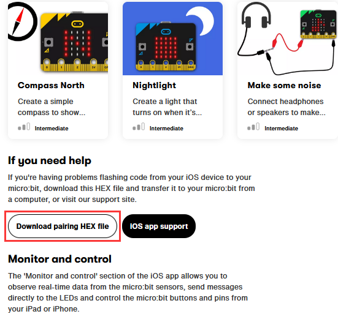

**Step 2:**

Search “micro bit”in your App Store to download the APP micro:bit.

**Step 3:** Connect your Apple device with Micro: Bit main board :

Firstly, turn on the Bluetooth of your Apple device and click icon
 to open the APP micro:bit and
select item “Choose micro:bit”to start pairing Bluetooth.

Secondly, click“Pair a new micro:bit”;

Following the instructions to press button A and B at the same time(do not
release them until you are told to) and press Reset & Power button for a few
seconds.

Release the Reset & Power button, you will see a password pattern shows on the
LED dot matrix. Now , release buttons A and B and click “Next”.

Set the password pattern on your Apple device as the same pattern showed on the
matrix and click “Next”.

Still click “Next”and a dialog box props up as shown below. Then click "Pair". A
few seconds later, the match is done and the LED dot matrix displays the "√"
pattern.

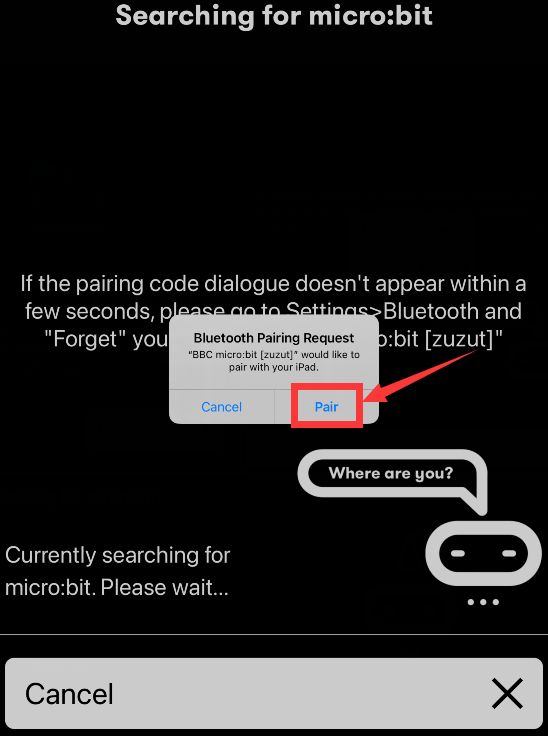

After the match with Bluetooth, write and upload code with the App.

Click “Create Code” to enter the programming page and write code.

Click  and the box
 appears, and then select “Create
√”.

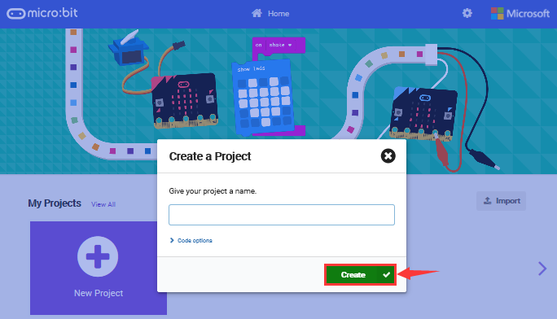

Name the project as “1 “and click
 to save it.

Click the third item“Flash”to enter the uploading page. The default code program
for uploading is the one saved just now and named "1" and then click the other
"Flash" to upload the code program "1".

If the program “1”is uploaded successfully a few seconds later, the App will
emerge as below and the LED dot matrix of the Micro: Bit main board will exhibit
a heart pattern.

# 8.Expansion Projects：

The former 14 projects are the introduction of sensors and modules. The further
lessons are challenging for new starters.

Note: (G), marked on each sensor and module, is the negative pole and connected
to “G”, ”-”or “GND”on the sensor shield or control board ; (V) is the positive
pole and linked with V , VCC, + or 5V on the sensor shield or control board. And
you need to connect a power in case that power supply is weak.

## Project 1：LED Blinks

**(1)Project Introduction**

We’ve set up the micro:bit smart home. Now let’s get started from the most
simple experiment---LED blink.

LED is a type of semiconductor called "Light Emitting Diode "which is an
electronic device made of semiconductor materials (silicon, selenium, germanium,
etc.). It features unidirectional conductivity, that is, the positive voltage is
applied to the anode (long leg) and the cathode (short leg) of the diode. when
the voltage of its anode is higher than the voltage of its cathode, thus, the
diode is turned on(LED is on). When a reverse voltage is applied to the anode
and cathode, the diode is disconnected(that is, the LED is off). Therefore, the
disconnection and connection of the diode is equivalent to turning on and off
LED. Light-emitting diodes have an anode (+) and a cathode (-), and they can
only allow current to flow from one anode to the cathode. The components will be
damaged if LED is directly connected to the power supply. It’s essential that a
certain resistor must be connected in series in the LED circuit.

1.  **Yellow LED：**

| Working Voltage:    | DC 3.3-5V                      |  |
|---------------------|--------------------------------|-------------------------------------------------|
| Working current：   | \< 20mA                        |                                                 |
| Max Power：         | 0.1W                           |                                                 |
| Control Ports:      | Digital ports (digital input） |                                                 |
| Working Temperature | -10°C \~ +50°C                 |                                                 |
| Display Color：     | Yellow                         |                                                 |

**(3)Test Code**

The route to get test codes（[How to load?](#_5.5.导入代码：)）

| Type     | Route                                                                                  | File Name                 |
|----------|----------------------------------------------------------------------------------------|---------------------------|
| Hex file | KS4027 folder/Makecode Tutorial/Makecode Code/Expansion Projects/Project 1: LED Blinks | Project 1：LED Blinks.hex |

You can also drag blocks to form code.

Command blocks can be found on the right as shown below:

Make combinations of these blocks:

| Micro：bit Shield | Yellow LED Module |
|-------------------|-------------------|
| GND               | G                 |
| 5V                | V                 |
| S（16）           | S                 |

**(4)Test Results:**

Upload the test code to the micro:bit，plug in power, dial the DIP switch to ON
and press“1”on the rocket switch.

The micro:bit will show smile expression，and a yellow LED will flash with an
interval of 1000ms. ([How to download?](#A01) [How to quick
download?](#_7.3.快速下载))

**Project 2：Breathing LED**

1.  **Project Introduction**

In previous lesson, we control LED on and off and make it blink.

In this project, we will control LED’s brightness through PWM simulating
breathing effect. Similarly, you can change the step length and delay time in
the code so as to demonstrate different breathing effects.

PWM is a means of controlling the analog output via digital means. Digital
control is used to generate square waves with different duty cycles (a signal
that constantly switches between high and low levels) to control the analog
output.In general, the input voltages of ports are 0V and 3V. What if the 1.5V
is required? Or a switch among 1V, 1.5V and 3V? We cannot change resistors
constantly. For this reason, we resort to PWM.

For Micro:bit digital port voltage outputs, there are only LOW and HIGH levels,
which correspond to the voltage outputs of 0V and 3V respectively. You can
define LOW as“0”and HIGH as“ 1’, and let Micro:bit output five
hundred“0”or‘1’within 1 second. If output five hundred‘1”, that is 3V; if all of
which is‘0’,that is 0V; if output 250 01 pattern, that is 1.5V.

This process can be likened to showing a movie. The movie we watch are not
completely continuous. Actually, it generates 25 pictures per second, which
cannot be told by human eyes. Therefore, we mistake it as a continuous process.
PWM works in the same way. To output different voltages, we need to control the
ratio of 0 and 1. The more‘0’or ‘1’ output per unit time, the more accurate the
control.

In the graphic below, the green lines represent a regular time period. This
duration or period is the inverse of the PWM frequency. In other words, with
Micro:bit's PWM frequency at about 500Hz, the green lines would measure 2
milliseconds each. A call to analogWrite() is on a scale of 0-255, such that
analogWrite(255) requests a 100% duty cycle (always on), and analogWrite(127) is
a 50% duty cycle (on half the time).

PWM is applied to light brightness adjustment, speed adjustment of motor and
sound emitting.

Parameters of PWM：

pulse width (minimum / max)

Pulse cycle (insertion of pulse frequency within 1 second)

Voltage level（0V-3V）

There are commonly used PWM ports, namely P0, P1, P2, P3, P4 and P10. And there
are other rarely used ports, namely P5, P6, P7, P8, P9, P11, P12, P13, P14, P15,
P16, P19 and P20.

In the experiment, we connect the port S of yellow LED Module to the port S (16)
of the expansion board. And P16 can also be used as a PWM interface.

**(2)Yellow LED：**

| Working Voltage:      | DC 3.3-5V                     |  |
|-----------------------|-------------------------------|-------------------------------------------------|
| Working Current：     | \< 20mA                       |                                                 |
| Max Power：           | 0.1W                          |                                                 |
| Control Port:         | digital port (digital input） |                                                 |
| Working Temperature： | -10°C \~ +50°C                |                                                 |
| Display Color：       | Yellow                        |                                                 |

**(3) Test Code**

The route to get test codes（[How to load?](#_5.5.导入代码：)）

| Type     | Route                                                                                     | File Name                    |
|----------|-------------------------------------------------------------------------------------------|------------------------------|
| Hex file | KS4027 folder/Makecode Tutorial/Makecode Code/Expansion Projects/Project 2: Breathing LED | Project 2：Breathing LED.hex |

You can also drag blocks to form code.

Command blocks can be found on the right as shown below:

Make combinations of these blocks:

| Micro:bit Expansion Board | Yellow LED Module |
|---------------------------|-------------------|
| GND                       | G                 |
| 5V                        | V                 |
| S（16）                   | S                 |

**(4)Test Results:**

Upload the test code to the micro:bit，plug in power, dial the DIP switch to ON
and press“1”on the rocket switch.

The micro:bit will show a smile expression, and LED smoothly changes its
brightness from light to dark and back to light, continuing to do so, which is
similar to a lung breathing in and out.

([How to download?](#A01) [How to quick download?](#_7.3.快速下载))

## Project 3：6812 2x2 Full Color RGB

**(1)Project Introduction**

6812 2X2 full-color RGB module integrates the controlling circuit and the
illuminating circuit. Each LED is the same as a 5050 LED lamp bead, and each
component is a pixel point. The inner pixel point includes a amplify driving
circuit that latch signal from digital ports shapes, a high-precision internal
oscillator and and a 12V high voltage programmable current control portion,
which effectively ensures that the color of the pixel point.

The data protocol uses a single-line zero code communication method. After the
pixel point is reset, the S-terminal receives the data transmitted from the
controller. First, the 24bit data sent by the first pixel is extracted by the
first pixel point, and sent to the internal portion of the pixel point.

It has the advantages of low-voltage driving, environmental protection, high
brightness, large scattering angle, good consistency, ultra-low power, long life
expectancy.

**(2)6812 2x2 Full-color RGB:**

| Working Voltage：                               | DC 3.3-5V  | Max Working Current： | 200mA        | Max Power:          | 1W                                |
|-------------------------------------------------|------------|-----------------------|--------------|---------------------|-----------------------------------|
| Working Temperature：                           | -10℃\~+50℃ | Source of light：     | SMD 5050 RGB | IC Type：           | 4 pcs/WS2811                      |
| Gray Scale：                                    | 256        | Illuminating Angle：  | 180°         | Illuminating Color: | Red, yellow, blue,green and white |
|  |            |                       |              |                     |                                   |

**(3)Add NeoPixel Library:**

Set code by the library, and click“Extensions”to add the library file.

Click the neoPixel library, then NeoPixel library is installed.

You can view it in the blocks list.

**(4)Test Code 1**

The route to get test codes（[How to load?](#_5.5.导入代码：)）

| File Type | Route                                                                                             | File Name             |
|-----------|---------------------------------------------------------------------------------------------------|-----------------------|
| Hex file  | KS4027 folder/Makecode Tutorial/Makecode Code/Expansion Projects/Project 3: 6812 2x2Full-colorRGB | Project 3：Code-1.hex |

You can also drag blocks to form code.

Command blocks can be found on the right as shown below:

Make combinations of these blocks:

| Micro:bit Expansion Board | 6812 2x2 Full Color  RGB Module |
|---------------------------|---------------------------------|
| GND                       | G                               |
| 5V                        | V                               |
| S（14）                   | S                               |

**(5)Test Result 1:**

Upload the Test Code 1to the micro:bit，plug in power, dial the DIP switch to ON
and press“1”on the rocket switch. You will view the 6812 RGB module display red,
orange,yellow, green, blue,Indigo, violet, purple and white, in loop way. ([How
to download?](#A01) [How to quick download?](#_7.3.快速下载))

**(6)Test Code 2:**

The route to get test codes（[How to load?](#_5.5.导入代码：)）

| File Type | Route                                                                                             | File Name             |
|-----------|---------------------------------------------------------------------------------------------------|-----------------------|
| Hex file  | KS4027 folder/Makecode Tutorial/Makecode Code/Expansion Projects/Project 3：6812 2x2Full-colorRGB | Project 3：Code-2.hex |

You can also drag blocks to form code.

Command blocks can be found on the right as shown below:

Make combinations of these blocks:

**7.5. Test Result2:**

Upload the test code 2 to the micro:bit，plug in power, dial the DIP switch to
ON and press“1”on the rocket switch.

You can view four WS2812RGB lights light up，like a flowing light.

([How to download?](#A01) [How to quick download?](#_7.3.快速下载))

**(8)Test Code 3:**

The route to get test codes（[How to load?](#_5.5.导入代码：)）

| File Type | Route                                                                                             | File Name             |
|-----------|---------------------------------------------------------------------------------------------------|-----------------------|
| Hex file  | KS4027 folder/Makecode Tutorial/Makecode Code/Expansion Projects/Project 3: 6812 2x2Full-colorRGB | Project 3：Code-3.hex |

You can also drag blocks to form code.

Command blocks can be found on the right as shown below:

Make combinations of these blocks:

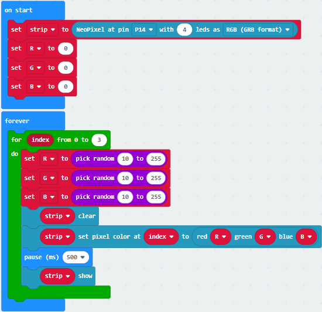

Upload the test code 3 to the micro:bit，plug in power, dial the DIP switch to
ON and press“1”on the rocket switch.

Then you will see 5 WS2812RGB lights light up with random colors, like a flowing
light.

([How to download?](#A01) [How to quick download?](#_7.3.快速下载))

**Project 4：PIR Motion Sensor**

**(1)Project Introduction**

The Pyroelectric infrared motion sensor can detect infrared signals from moving
objects, and output switching signals. Applied to a variety of occasions, it can
detect movement of human body.

Conventional pyroelectric infrared sensors are much more bigger, with complex
circuit and lower reliability. Yet, this new pyroelectric infrared motion
sensor, is more practical. It integrates a digital pyroelectric infrared sensor
and connecting pins. It features higher sensibility and reliability, lower power
consumption, light weight, small size, lower voltage working mode and simpler
peripheral circuit.

**(2)About PIR Motion Sensor:**

| Working Voltage：      | DC 4.5-6.5V                                          |
|------------------------|------------------------------------------------------|
| Max Working Current：  | 50MA                                                 |
| Static Current:        | \<50uA                                               |
| Control Port：         | Digital output (high level is 3.3V，low level is 0V) |
| Control Signals:       | Digital signal 1/0                                   |
| Working Temperature：  | -10 \~ 50 ℃                                          |
| Max detection distance | 4m                                                   |
| Sensing Angle：        | ＜100°                                               |
| Trigger Way:           | L doesn’t repeatedly trigger/H trigger repeatedly    |

Note：

1\. The maximum distance is 4 meters during testing.

2\. In the test, open the white lens to check rectangular sensing part. When the
long line of the sensing part is parallel to the ground, the distance is the
best.

3\. In the test, covering the sensor with white lens can sense the distance
precisely.

4\. The distance is best at 25℃, and the detection distance value will reduce
when temperature exceeds 30℃.

5\. After powering up and uploading the code, you can start testing after 5-10
seconds, otherwise the sensor is not sensitive.

**(3)Test Code:**

The route to get test codes（[How to load?](#_5.5.导入代码：)）

| File Type | Route                                                                                         | File Name                        |
|-----------|-----------------------------------------------------------------------------------------------|----------------------------------|
| Hex file  | KS4027 folder/Makecode Tutorial/Makecode Code/Expansion Projects/Project 4：PIR Motion Sensor | Project 4：PIR Motion Sensor.hex |

You can also drag blocks to form code.

Command blocks can be found on the right as shown below:

Make combinations of these blocks:

| Micro:bit Expansion Board | PIR Motion Sensor |
|---------------------------|-------------------|
| GND                       | G                 |
| 5V                        | V                 |
| S（15）                   | S                 |

**(4)Test Results:**

Upload the test code to the micro:bit，plug in power, dial the DIP switch to ON
and press“1”on the rocket switch.

The micro:bit will show a smile image. Then click“Show console device”

([How to download?](#A01) [How to quick download?](#_7.3.快速下载))

If PIR motion sensor detects someone nearby, the serial monitor will display “1”
, and the indicator on the module will be off. If nobody is around, the serial
monitor will show “0”, the indicator will be on.

As shown below:

If your computer system is Windows7/8 instead of Windows 10, the device can’t be
paired in Google Chrome, as a result, the digital and analog signals can’t be
read.

Here, we need CoolTerm software to read data.

Open CoolTerm, click Options to select SerialPort. Set COM port and 115200 baud
rate(the baud rate of USB serial communication of micro:bit V2 is 115200 through
the test). Click“OK”and“Connect”.

## Project 5：Induction Lamp

**(1)Project Introduction**

In the previous project experiment, we have mastered the working principle of
the PIR motion sensor and its control method. In this project, we combine it
with a yellow LED to control LED’s brightness

**(2)Test Code:**

The route to get test codes（[How to load?](#_5.5.导入代码：)）

| File Type | Route                                                                                       | File Name                      |
|-----------|---------------------------------------------------------------------------------------------|--------------------------------|
| Hex file  | KS4027 folder/Makecode Tutorial/Makecode Code/Expansion Projects/Project 5：Induction Light | Project 5：Induction Light.hex |

You can also drag blocks to form code.

Command blocks can be found on the right as shown below:

Make combinations of these blocks:

| Micro:bit Expansion Board | PIR Motion Sensor |   | Micro:bit Expansion Board | Yellow LED Module |
|---------------------------|-------------------|---|---------------------------|-------------------|
| GND                       | G                 |   | GND                       | G                 |
| 5V                        | V                 |   | 5V                        | V                 |
| S（15）                   | S                 |   | S（16）                   | S                 |

**(3)Test Results:**

Upload the test code to the micro:bit, plug in power, dial the DIP switch to ON
and press“1”on the rocket switch.

The micro:bit will show a smile image.

When the PIR motion sensor detects people, the yellow LED will be on; otherwise,
the LED will be off.

([How to download?](#A01) [How to quick download?](#_7.3.快速下载))

**Project 6: Adjust angles of servo**

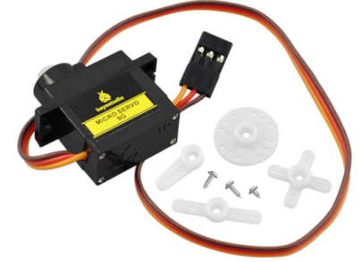

1.  **Project Introduction**

Servo motor is a position control rotary actuator. It mainly consists of a
housing, a circuit board, a core-less motor, a gear and a position sensor. Its
working principle is that the servo receives the signal sent by MCU or receiver
and produces a reference signal with a period of 20ms and width of 1.5ms, then
compares the acquired DC bias voltage to the voltage of the potentiometer and
obtain the voltage difference output.

When the motor speed is constant, the potentiometer is driven to rotate through
the cascade reduction gear, which leads that the voltage difference is 0, and
the motor stops rotating. Generally, the angle range of servo rotation is 0°
\--180°.

1.  **Working Principle of Servo：**

The rotation angle of servo motor is controlled by regulating the duty cycle of
PWM (Pulse-Width Modulation) signal. The standard cycle of PWM signal is 20ms
(50Hz). Theoretically, the width is distributed between 1ms-2ms, but in fact,
it's between 0.5ms-2.5ms. The width corresponds the rotation angle from 0° to
180°. But note that for different brand motors, the same signal may have
different rotation angles.

Through the experiment, the pulse range of the servo is 0.65ms\~2.5ms.

| high level time | Servo angle | Reference signal cycle time（20ms） |
|-----------------|-------------|-------------------------------------|
| 0.65ms          | 0°          | 0.65ms high level+19.35mslow level  |
| 1.5ms           | 90°         | 1.5ms high level+18.5mslow level    |
| 2.5ms           | 180°        | 2.5ms high level+17.5mslow level    |

1.  **Servo：**

| Working voltage：     | DC 4.8V〜6V                                            | Operational Angle： | About 180°(500→2500μsec) |
|-----------------------|--------------------------------------------------------|---------------------|--------------------------|
| Pulse width range：   | 500→2500 μsec                                          | Size：              | 22.9\*12.2\*30mm         |
| No-load speed：       | 0.12±0.01 sec/60°（DC 4.8V） 0.1±0.01 sec/60°（DC 6V） |                     |                          |
| No-load current：     | 200±20mA（DC 4.8V） 220±20mA（DC 6V）                  |                     |                          |
| Stop torque：         | 1.3±0.01kg·cm（DC 4.8V） 1.5±0.1kg·cm（DC 6V）         |                     |                          |
| Stop current：        | ≦850mA（DC 4.8V） ≦1000mA（DC 6V）                     |                     |                          |
| Standby Current：     | 3±1mA（DC 4.8V） 4±1mA（DC 6V）                        |                     |                          |
| Weight:               | 9±1g (without servo horn)                              |                     |                          |
| Working temperature： | -30℃\~60℃                                              |                     |                          |

Note: Supplying power via USB cable or computer may burn the servo; thus, we
recommend using batteries.

**(4)Test Code:**

The route to get test codes（[How to load?](#_5.5.导入代码：)）

| File Type | Route                                                                                              | File Name                             |
|-----------|----------------------------------------------------------------------------------------------------|---------------------------------------|
| Hex file  | KS4027 folder/Makecode Tutorial/Makecode Code/Expansion Projects/Project 6: Adjust angles of servo | Project 6：Adjust angles of servo.hex |

You can also drag blocks to form code.

Command blocks can be found on the right as shown below:

Make combinations of these blocks:

| Micro:bit Expansion Board | Servo  |
|---------------------------|--------|
| GND                       | Brown  |
| 5V                        | Red    |
| S（8）                    | Orange |

**(5)Test Results:**

Upload the test code to the micro:bit, plug in power, dial the DIP switch to ON
and press“1”on the rocket switch. The micro:bit will show smile expression, the
servo will rotate 0°\~45°\~90°\~135°\~180°\~0°，in loop way. ([How to
download?](#A01) [How to quick download?](#_7.3.快速下载))

## Project 7: 130 Motor

**(1)Project Introduction**

130 motor adopts the HR1124S chip which is applied to single-channel H-bridge
drive chip in direct current motor.

H-bridge driving part uses the PMOS and NMOS power tubes of low on-resistance.
In addition, the HR1124S chip has the low standby and static current.

This motor is compatible with all kinds of MCU control boards. It comes with
2.54mm anti-reverse white connectors. In the experiment, you can take advantage
of the voltage direction of IN+和IN- to control the rotation of motor and alter
its speed via PWM signals

**(2)Parameters：**

| Working Voltage：                               | 3.3-5V(DC)    | Max Current：             | 200mA (DC5V)                       |
|-------------------------------------------------|---------------|---------------------------|------------------------------------|
| Max Power：                                     | 1W            | Control port：            | Dual digital port（digital input） |
| Working Temperature：                           | -10°C \~+50°C | Environmental Attribute： | ROHS                               |
| 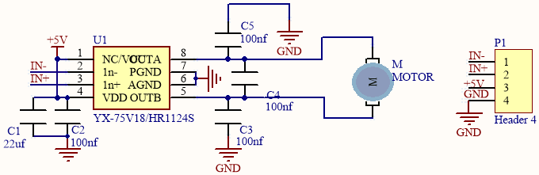 |               |                           |                                    |

**(3) Test Code 1:（high/low level control）**

The route to get test codes（[How to load?](#_5.5.导入代码：)）

| File Type | Route                                                                                 | File Name             |
|-----------|---------------------------------------------------------------------------------------|-----------------------|
| Hex file  | KS4027 folder/Makecode Tutorial/Makecode Code/Expansion Projects/Project 7：130 Motor | Project 7：Code-1.hex |

You can also drag blocks to form code.

Command blocks can be found on the right as shown below:

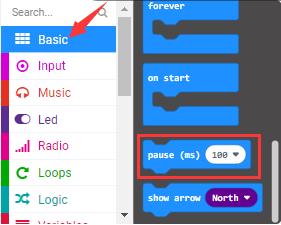

Make combinations of these blocks:

| Micro:bit Expansion Board | Motor |
|---------------------------|-------|
| GND                       | G     |
| 5V                        | V     |
| S（13）                   | IN+   |
| S（12）                   | IN-   |

**Code Explanation：**

| IN+（digital port P12）                         | IN-（digital port P13） | Fan              |
|-------------------------------------------------|-------------------------|------------------|
| high level（1）                                 | low level（0）          | Rotate clockwise |
|  |                         |                  |

| IN+（digital portP12）                          | IN-（digital port P13） | fan                  |
|-------------------------------------------------|-------------------------|----------------------|
| low level（0）                                  | high level（1）         | Rotate anticlockwise |
|  |                         |                      |

| IN+（digital portP12）                          | IN-（digital port P13） | fan          |
|-------------------------------------------------|-------------------------|--------------|
| low level（0）                                  | low level（0）          | Not rotating |
|  |                         |              |

| IN+（digital portP12）                          | IN-（digital port P13） | fan          |
|-------------------------------------------------|-------------------------|--------------|
| high level（1）                                 | high level（1）         | Not rotating |
|  |                         |              |

**4.Test Code 2：（PWM Speed control ）**

The route to get test codes（[How to load?](#_5.5.导入代码：)）

| File Type | Route                                                                                 | File Name             |
|-----------|---------------------------------------------------------------------------------------|-----------------------|
| Hex file  | KS4027 folder/Makecode Tutorial/Makecode Code/Expansion Projects/Project 7：130-Motor | Project 7：Code-2.hex |

You can edit code blocks yourself:

Make combinations of these blocks:

**Code Explanation：**

| IN+（digital portP12）                          | IN-（digital portP13） | fan              |
|-------------------------------------------------|------------------------|------------------|
| high level（1）                                 | PWM 600                | Rotate clockwise |
|  |                        |                  |

| IN+（digital portP12）                          | IN-（digital portP13） | Fan                  |
|-------------------------------------------------|------------------------|----------------------|
| low level（0）                                  | PWM 400                | Rotate anticlockwise |
|  |                        |                      |

| IN+（digital portP12）                          | IN-（digital portP13） | fan          |
|-------------------------------------------------|------------------------|--------------|
| low level（0）                                  | PWM 0                  | Not rotating |
|  |                        |              |

| IN+（digital portP12）                          | IN-（digital portP13） | fan          |
|-------------------------------------------------|------------------------|--------------|
| high level（1）                                 | PWM 1023               | Not rotating |
|  |                        |              |

**5.Test Results：**

Upload the test code to the micro:bit, plug in power, dial the DIP switch to ON
and press“1”on the rocket switch. The fan will rotate clockwise for 5s, stop 1,
rotate anticlockwise for 5s and stop for 1s, in loop way. ([How to
download?](#A01) [How to quick download?](#_7.3.快速下载))

## Project 8：Lithium Battery Power Module

**(1)Project Introduction**

This module integrates a charging and discharging chip, which can be interfaced
with an external rechargeable battery through the PH2.0MM interface. In the
experiment,we use a single lithium battery.

It has a Micro USB port and a charging port for solar panels, which can supply
power for an external lithium battery.

In addition, this module has a boost module which can increase the voltage of
batteries to 6.6V. The DIP switch on the module is the OUTPUT switch of 6.6V.
The pin G and V can output 6.6V and the pin S can read the battery voltage after
the resistance 1/2 voltage

1.  **Parameters：**

| Charging Port                             | Micro USB, HP2.0MM port for solar panels |
|-------------------------------------------|------------------------------------------|
| Input Voltage of ports of the solar panel | 4.4-6V                                   |
| constant-voltage charging                 | 4.15-4.24V                               |
| Max Charging Current                      | 800mA                                    |
| Output Port                               | 3 P 2.54mm Pins                          |
| Input Voltage                             | 6.6V                                     |
| Max Output Current                        | 800mA                                    |
| Batteries                                 | Single-cell Lithium Battery              |
| Environmental Attribute                   | ROHS                                     |

1.  **Schematic Diagram：**

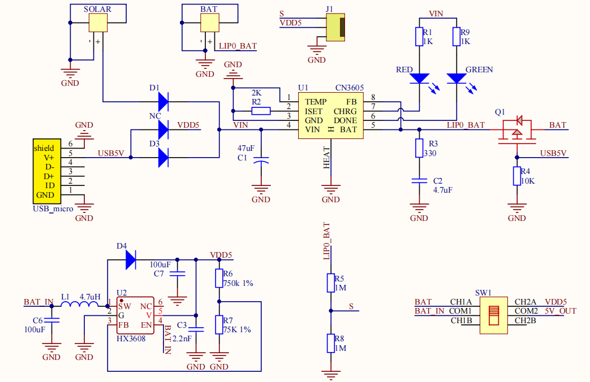

1.  **Features：**

SOLAR4.8-6.0V, the input port of power, is connected to polar panels.

The solar energy is converted into electric energy via solar panels.

BAT, the output port of power, is interfaced with the lithium battery
holder(rechargeable batteries) and saves the electric energy into batteries.

This is the switch. Slid to ON end, then the external lithium battery will be
connected, supplying to the expansion board; on the contrary, slide to OFF, then
the current of lithium battery will be disconnected.

You can charge the lithium battery via USB cable.

**Test the solar battery panel：**

We can connect the solar battery panel and an LED we provide together, as shown
below.

Disconnect the power, after a while, you will see the LED light up.

****

## Project 9：1602 LCD

1.  **Project Introduction**

With I2C communication module, this is a display module that can show 2 lines
with 16 characters per line.

It shows blue background and white word and connects to I2C interface of MCU,
which highly save the MCU resources.

On the back of LCD display, there is a blue potentiometer for adjusting the
backlight. The communication address defaults to 0x27.

The original 1602 LCD can start and run with 7 IO ports, but ours is built with
Arduino IIC/I2C interface, saving 5 IO ports. Alternatively, the module comes
with 4 positioning holes with a diameter of 3mm, which is convenient for you to
fix on other devices.

Notice that when the screen gets brighter or darker, the characters will become
more visible or less visible.

1.  **Parameters：**

| Working Voltage ：                                               | DC5V                                             | I2C Address：                                                      | 0x27                     | Control Port： | I2C      |
|------------------------------------------------------------------|--------------------------------------------------|--------------------------------------------------------------------|--------------------------|----------------|----------|
| Working Current：                                                | \< 130mA                                         | Working Temperature：                                              | 0°C \~ 45°C（recommend） | Driving Chip： | PCF8574T |
| GND: a pin connected to the ground                               |  VCC：A pin that connects to a +5V power supply  | SDA： A pin that connects to analog port A4 for IIC communication  |                          |                |          |
| SCL：a pin interfaced with SCL or A5，used for IIC communication | Backlight                                        | Adjustable contrast                                                |                          |                |          |

**(3)Add I2C LCD 1602 Library：**

Set code by the library, and click“Extensions”to add the library file:

Tap <https://github.com/keyestudio2019/ks_IoT> in the searching box and
click“Search”, as shown below. Click **IoT_keyestudio** library. Then the
IoT_keyestudio library is set up.

In addition, the I2C LCD 1602 library is included in the **IoT_keyestudio.**

You can check the I2C LCD 1602 library in the block list.

**(4)Test Code:**

The route to get test codes（[How to load?](#_5.5.导入代码：)）

| File Type | Route                                                                                | File Name               |
|-----------|--------------------------------------------------------------------------------------|-------------------------|
| Hex file  | KS4027 folder/Makecode Tutorial/Makecode Code/Expansion Projects/Project 9：1602 LCD | Project 9：1602 LCD.hex |

You can also drag blocks to form code.

Command blocks can be found on the right as shown below:

Make combinations of these blocks:

| Micro:bit Expansion Board | I2C 1602 LCD Module |
|---------------------------|---------------------|
| GND                       | GND                 |
| 5V                        | 5V                  |
| SDA                       | SDA                 |
| SCL                       | SCL                 |

**(5)Test Results:**

Upload the test code to the micro:bit，plug in power, dial the DIP switch to ON
and press“1”on the rocket switch.

The micro:bit board will show a smile image. Then rotate the knob of the
potentiometer at the back of the LCD module, you will see“Keyestudio”at one row
and numbers at the second row. In addition, the number increases by 1 with an
interval of 0.5s.

([How to download?](#A01) [How to quick download?](#_7.3.快速下载))

Note: When the display doesn’t show characters, you can adjust the potentiometer
behind the 1602LCD and backlight to make the 1602LCD display the corresponding
character string.

## Project 10：Steam Sensor

**(1)Project Introduction**

This is a commonly used steam sensor. Its principle is to detect the amount of
water by bare printed parallel lines on the circuit board. The more the water
content is, the more wires will be connected. As the conductive contact coverage
increases, the output voltage will gradually rise. It can detect water vapor in
the air as well. The steam sensor can be used as a rain water detector and level
switch. When the humidity on the sensor surface surges, the output voltage will
increase.

The sensor is compatible with various microcontroller control boards, such as
Arduino series microcontrollers. When using it, connect the sensor to the analog
port of the Micro:bit microcontroller, and display the corresponding analog
value on the serial monitor.

Note: the connection part is not waterproof, therefore, don’t immerse it in the
water please.

**(2) Parameters：**

| Working Voltage：           | DC 3.3-5V                                                              |  |
|-----------------------------|------------------------------------------------------------------------|-------------------------------------------------|
| Working Temperature Range： | －10℃～＋70℃                                                           |                                                 |
| Max Working Current：       | 5uA (DC5V，when the two pins of the steam sensor are in short circuit. |                                                 |
| Control Port：              | Analog output                                                          |                                                 |

**(3)Test Code:**

The route to get test codes（[How to load?](#_5.5.导入代码：)）

| File Type | Route                                                                                     | File Name                    |
|-----------|-------------------------------------------------------------------------------------------|------------------------------|
| Hex file  | KS4027 folder/Makecode Tutorial/Makecode Code/Expansion Projects/Project 10：Steam Sensor | Project 10：Steam Sensor.hex |

You can also drag blocks to form code.

Command blocks can be found on the right as shown below:

Make combinations of these blocks:

| Micro:bit Expansion Board | Steam Sensor |
|---------------------------|--------------|
| GND                       | G            |
| 3V3                       | V            |
| S(0)                      | S            |

**(4)Test Results:**

Upload the test code, and plug in power with micro USB cable. Then the micro:bit
will show“❤”. At same time, click the“Show console Device” ([How to
download?](#A01) [How to quick download?](#_7.3.快速下载))

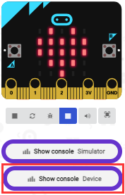

The more the immersed area of the module, the larger the analog value.

As shown below;

The serial monitor will show the output data, and the steam sensor will read the
analog signals at the signal end.

If your computer system is Windows7/8 instead of Windows 10, the device can’t be
paired in Google Chrome, as a result, the digital and analog signals can’t be
read.

Here, we need CoolTerm software to read data.

Open **CoolTerm**, click **Options** to select **SerialPort**. Set **COM** port
and 115200 baud rate(the baud rate of USB serial communication of micro:bit V2
is 115200 through the test). Click“OK”and“Connect”.

The more the immersed area of the module, the larger the analog value.

As shown below;

## Project 11：Rains Alarm

**(1)Project Introduction**

Steam Sensor is a wide range of applications, such as raining alarm, automotive
automatic scraping system, intelligent lighting system, and smart sunroof
system. In the previous project experiment, we already know the working
principle of Steam Sensor, then in this project experiment, we combine Steam
Sensor, Micro:bit, and yellow LEDs, making a simple rain alarm.

**(2)Test Code:**

The route to get test codes（[How to load?](#_5.5.导入代码：)）

| File Type | Route                                                                                    | File Name                   |
|-----------|------------------------------------------------------------------------------------------|-----------------------------|
| Hex file  | KS4027 folder/Makecode Tutorial/Makecode Code/Expansion Projects/Project 11：Rains Alarm | Project 11：Rains Alarm.hex |

You can also drag blocks to form code.

Command blocks can be found on the right as shown below:

Make combinations of these blocks:

| Micro:bit Expansion Board | Steam Sensor |   | Micro:bit Expansion Board | Yellow LED Module |
|---------------------------|--------------|---|---------------------------|-------------------|
| GND                       | G            |   | GND                       | G                 |
| 3V3                       | V            |   | 5V                        | V                 |
| S（0）                    | S            |   | S（16）                   | S                 |

**(3)Test Results:**

Upload the test code to the micro:bit，plug in power, dial the DIP switch to ON
and press“1”on the rocket switch.

The micro:bit will show smile expression. When the detected analog signals are
more than 500, the micro:bit will emit“tick, tick”and the yellow LED will flash.
Otherwise, no sound and LED off.

([How to download?](#A01) [How to quick download?](#_7.3.快速下载))

## Project 12：Analog Gas（MQ-2）Sensor

**(1)Project Introduction**

This gas sensor is used for household gas leak alarms, industrial combustible
gas alarms and portable gas detection instruments. Also, it is suitable for the
detection of liquefied gas, benzene, alkane, alcohol, hydrogen, etc.,

The MQ-2 smoke sensor can be accurately a multi-gas detector, with the
advantages of high sensitivity, fast response, good stability, long life, and
simple drive circuit.

It can detect the concentration of flammable gas and smoke in the range of
300\~10000ppm. Meanwhile, it has high sensitivity to natural gas, liquefied
petroleum gas and other smoke, especially to alkanes smoke.

It must be heated for a period of time before using the smoke sensor, otherwise
the output resistance and voltage are not accurate. However, the heating voltage
should not be too high, otherwise it will cause internal signal line to blow.

It belongs to the tin dioxide semiconductor gas-sensitive material. At a certain
temperature, tin dioxide adsorbs oxygen in the air and forms negative ion
adsorption of oxygen, reducing the electron density in the semiconductor,
thereby increasing its resistance value.

When in contact with flammable gas in the air and smog, and the potential
barrier at the grain boundary is adjusted by the smog, it will cause the surface
conductivity to change. With this, information about the presence of smoke or
flammable gas can be obtained. The greater the concentration of smoke or
flammable gas in the air, the greater the conductivity, and the lower the output
resistance, the larger the analog signal output. In addition, the sensitivity
can be adjusted by rotating the potentiometer.

1.  **Analog Gas（MQ-2）Sensor：**

| Working Voltage：          | 3.3-5V                             | 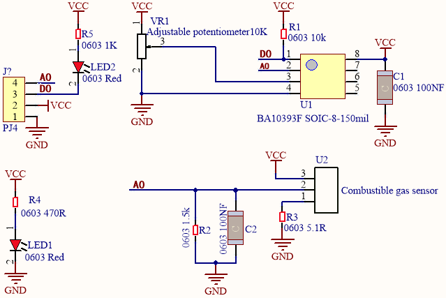 |
|----------------------------|------------------------------------|-------------------------------------------------|
| Working Current：          | 160mA (DC5V)                       |                                                 |
| Working Temperature：      | 0°C \~ 40°C                        |                                                 |
| Control Port：             | Digital and analog output          |                                                 |
| Detection concentration：  | 300-10000ppm (combustible gas )    |                                                 |
| Rake Ratio：               | ≤0.6(R3000ppm/R1000ppm C3H8)       |                                                 |
| Sensitivity                | Rs(in air)/Rs(1000ppm isobutane)≥5 |                                                 |
| Sensitive Resistance（Rs） | 2KΩ-20KΩ(in 2000ppm C3H8 )         |                                                 |

**Features：**

(1) Have a signal output instruction.

(2) Dual-channel signal output (analog output and TTL level output)

(3) TTL output effective signal is Low Level. (When the Low Level is output, the
signal light will be on)

(4) The analog output is 0 \~ 5V voltage. The higher the concentration, the
higher the voltage.

(5) a good sensitivity to liquefied gas, natural gas and urban gas.

(6) Have long-term life expectancy and reliable stability

(7) Fast response recovery.

**3.Test Code：**

The route to get test codes（[How to load?](#_5.5.导入代码：)）

| File Type | Route                                                                                                | File Name                               |
|-----------|------------------------------------------------------------------------------------------------------|-----------------------------------------|
| Hex file  | KS4027 folder/Makecode Tutorial/Makecode Code/Expansion Projects/Project 12：Analog Gas(MQ-2) Sensor | Project 12：Analog Gas(MQ-2) Sensor.hex |

You can also drag blocks to form code.

Command blocks can be found on the right as shown below:

Make combinations of these blocks:

| Micro:bit Expansion Board | Analog Gas（MQ-2）Sensor |
|---------------------------|--------------------------|
| GND                       | G                        |
| 5V                        | V                        |
| S（1）                    | D                        |

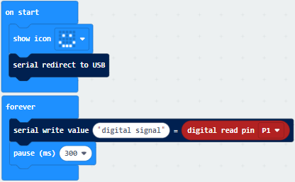

**(4)Test Results:**

Upload the test code to the micro:bit, plug in power and dial the DIP switch to
ON. Then the micro:bit will show smile expression and a green indicator will be
on. You can adjust the blue potentiometer to make the sensitivity high.

The micro:bit will show a smile image. You can maintain the sensitivity good by
adjusting the blue potentiometer and click“Show Console Device”.

([How to download?](#A01) [How to quick download?](#_7.3.快速下载))

The serial monitor will show 1 if the sensor doesn’t detect any gas; however, if
you make the firelighter close to it, number 0 will be output and the indicator
will be on. As shown below;

If your computer system is Windows7/8 instead of Windows 10, the device can’t be
paired in Google Chrome, as a result, the digital and analog signals can’t be
read.

Here, we need CoolTerm software to read data.

Open CoolTerm, click Options to select SerialPort. Set COM port and 115200 baud
rate(the baud rate of USB serial communication of micro:bit V2 is 115200 through
the test). Click“OK”and“Connect”.

Enable fire lighter and make it close to the gas sensor , the serial monitor
will print 0; however, if you remove the fire lighter, number 1 will be output.

## Project 13：Gas Leakage Detector

**(1)Project Introduction**

This MQ-2 gas sensor is used for household gas leak alarms, industrial
combustible gas alarms and portable gas detection instruments. And it is
suitable for the detection of liquefied gas, benzene, alkane, alcohol, hydrogen,
etc., and widely used in various fire alarm systems. It can be accurately a
multi-gas detector, and has the advantages of high sensitivity, fast response,
good stability, long life, and simple drive circuit.

It can detect the concentration of flammable gas and smoke in the range of
300\~10000ppm.Meanwhile, it has high sensitivity to natural gas, liquefied
petroleum gas and other smoke, especially to alkanes smoke.

We will make a gas leakage detector with a MQ-2 gas sensor, a yellow LED and a
1602 LCD.

**(2)Add the 1602 LCD library**

Library link: <https://github.com/keyestudio2019/ks_IoT>

(refer to the project 91602 LCD)

**(3)Test Code:**

The route to get test codes（[How to load?](#_5.5.导入代码：)）

| File Type | Route                                                                                             | File Name                            |
|-----------|---------------------------------------------------------------------------------------------------|--------------------------------------|
| Hex file  | KS4027 folder/Makecode Tutorial/Makecode Code/Expansion Projects/Project 13: Gas Leakage Detector | Project 13：Gas Leakage Detector.hex |

You can also drag blocks to form code.

Command blocks can be found on the right as shown below:

Make combinations of these blocks:

| Micro:bit Expansion Board | Analog Gas（MQ-2）Sensor |   | Micro:bit Expansion Board | Yellow LED Module |   | Micro:bit Expansion Board | 1602 LCD Module |
|---------------------------|--------------------------|---|---------------------------|-------------------|---|---------------------------|-----------------|
| GND                       | G                        |   | GND                       | G                 |   | GND                       | GND             |
| 5V                        | V                        |   | 5V                        | V                 |   | 5V                        | 5V              |
| S（1）                    | D                        |   | S（16）                   | S                 |   | SDA                       | SDA             |
|                           |                          |   |                           |                   |   | SCL                       | SCL             |

**(4)Test Results**

Upload the test code to the micro:bit，plug in power, dial the DIP switch to ON
and press“1”on the rocket switch.

The micro:bit will show a smile image. Make a fire lighter close to the gas
sensor and press its button, 1602 LCD will display“MQ-2”at the first row and
show“gas leakage”at the second row. At same time, it will emit“tick,tick”sound
and LED will flash.

([How to download?](#A01) [How to quick download?](#_7.3.快速下载))

## Project 14：DHT11 Temperature and Humidity Sensor

**(1)Project Introduction**

This DHT11 temperature and humidity sensor is a composite sensor which contains
a calibrated digital signal output of the temperature and humidity.

DHT11 temperature and humidity sensor uses the acquisition technology of the
digital module and temperature and humidity sensing technology, ensuring high
reliability and excellent long-term stability.

It includes a resistive element and a NTC temperature measuring device.

**(2) Parameters：**

| Working Voltage：     | 3.3V-5V（DC）              |     |
|-----------------------|----------------------------|----------------------------------------------------|
| Max Working Current： | 50mA                       |                                                    |
| Max Power：           | 0.25W                      |                                                    |
| Control Port：        | Digital two-way single bus |                                                    |
| Temperature Range：   | 0-50℃（±2℃）               |                                                    |
| Humidity Range        | 20-90%RH（±5%RH）          |                                                    |
| Working Temperature   | -25℃\~+60℃                 |                                                    |

**DHT11 Temperature and Humidity Sensor：**

|                 | **Single-bus data format**                                                                                                                                                                                                                                     |
|-----------------|----------------------------------------------------------------------------------------------------------------------------------------------------------------------------------------------------------------------------------------------------------------|
| Initial signal  | The microprocessor pulls down the data bus(SDA) for at least 18 ms (less than 30 ms)                                                                                                                                                                           |
| Response signal | The sensor pulls down the data bus (SDA) 83 μs, and then pulls up 87 μs to respond to the initial signal of the host.                                                                                                                                          |
|  humidity       | The humidity high-bit is the humidity integer part of the data, the humidity low-bit is the humidity fractional part of the data.                                                                                                                              |
|   temperature   | The temperature high-bit is the temperature integer part of the data, the temperature low-bit is the temperature fractional part of the data. And the temperature low bit8 is 1, which indicates the negative temperature; otherwise the positive temperature. |
| Check bit       | Check bit = humidity high bit + humidity low bit+ temperature high bit + temperature low bit                                                                                                                                                                   |

**Overall Communication Process：**

After the user host (MCU) sends a start signal, the DHT11 is converted from the
low consumption mode to the high one. After the start signal is completed, the
DHT11 sends the 40bit data, triggering an information collection. The signal
transmission is shown in the figure.

Communication protocol of DHT11 Sensor：

<https://www.mouser.com/datasheet/2/758/DHT11-Technical-Data-Sheet-Translated-Version-1143054.pdf>

**(4)Add the DHT11 library**

Set code by the library, and click“Extensions”to add the library file.

Copy the link <https://github.com/keyestudio2019/ks_IoT> in the searching box,
as shown below and click the **IoT_keyestudio** library. Then the
**IoT_keyestudio** library is set up.

You can find it in the blocks list.

**(5)Test Code:**

The route to get test codes（[How to load?](#_5.5.导入代码：)）

| File Type | Route                                                                                                              | File Name                                             |
|-----------|--------------------------------------------------------------------------------------------------------------------|-------------------------------------------------------|
| Hex file  | KS4027 folder/Makecode Tutorial/Makecode Code/Expansion Projects/Project 14：DHT11 Temperature and Humidity Sensor | Project 14：DHT11 Temperature and Humidity Sensor.hex |

You can also drag blocks to form code.

Command blocks can be found on the right as shown below:

Make combinations of these blocks:

| Micro:bit Expansion Board | DHT11 Temperature and Humidity Sensor |
|---------------------------|---------------------------------------|
| GND                       | G                                     |
| 5V                        | V                                     |
| S（2）                    | S                                     |

**(6)Test Results:**

Upload the test code to the micro:bit，plug in power, dial the DIP switch to ON
and press“1”on the rocket switch. The micro:bit will show a smile image. Then
click“Show console Device” ([How to download?](#A01) [How to quick
download?](#_7.3.快速下载))

The detected temperature and humidity value is shown as below:

If your computer system is Windows7/8 instead of Windows 10, the device can’t be
paired in Google Chrome, as a result, the digital and analog signals can’t be
read.

Here, we need CoolTerm software to read data.

Open CoolTerm, click Options to select SerialPort. Set COM port and 115200 baud
rate(the baud rate of USB serial communication of micro:bit V2 is 115200 through
the test). Click“OK”and“Connect”.

The temperature and humidity value will be displayed on the serial monitor, as
shown below:

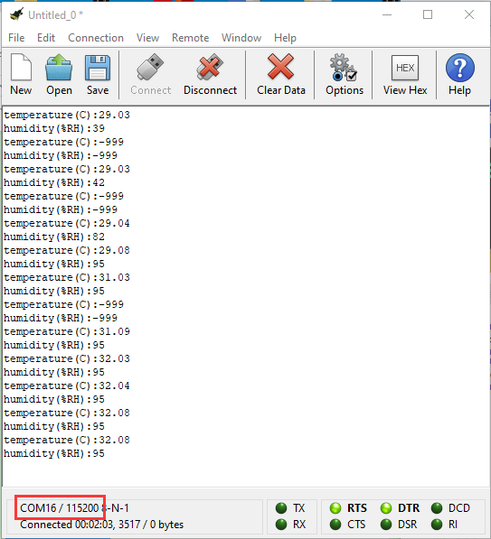

## Project 15：Temperature and Humidity Display

**(1)Project Introduction**

We’ve mastered the working principle of the DHT11 temperature and humidity
sensor. In this project, we will make a temperature and humidity display with it
and a 1602 LCD.

1.  **Add the 1602 LCD and DHT11 library：**

The link to add libraries: <https://github.com/keyestudio2019/ks_IoT>

You can refer to project 9 and 14

**3.Test Code：**

The route to get test codes（[How to load?](#_5.5.导入代码：)）

| File Type | Route                                                                                                         | File Name                                        |
|-----------|---------------------------------------------------------------------------------------------------------------|--------------------------------------------------|
| Hex file  | KS4027 folder/Makecode Tutorial/Makecode Code/Expansion Projects/Project 15：Temperature and Humidity Display | Project 15：Temperature and Humidity Display.hex |

You can also drag blocks to form code.

Command blocks can be found on the right as shown below:

Make combinations of these blocks:

| Micro:bit Expansion Board | DHT11 Temperature and Humidity Sensor |   | Micro:bit Expansion Board | 1602 LCD Module |
|---------------------------|---------------------------------------|---|---------------------------|-----------------|
| GND                       | G                                     |   | GND                       | GND             |
| 5V                        | V                                     |   | 5V                        | 5V              |
| S（2）                    | S                                     |   | SDA                       | SDA             |
|                           |                                       |   | SCL                       | SCL             |

**4.Test Results：**

Upload the test code to the micro:bit，plug in power, dial the DIP switch to ON
and press“1”on the rocket switch. The micro:bit will show smile image.

The 1602 LCD will show the temperature and humidity value in the current
environment. ([How to download?](#A01) [How to quick download?](#_7.3.快速下载))

## Project 16：Multiple Functions

1.  **Project Description: ：**

The final lesson is the combination of all modules and sensors. It is an analog
smart home.

**2.Preparation：**

A micro:bit and the smart home model.

Interface the micro:bit with a computer with a micro USB cable.

Add the libraries：https://github.com/keyestudio2019/ks_IoT

**3. Test Code:**

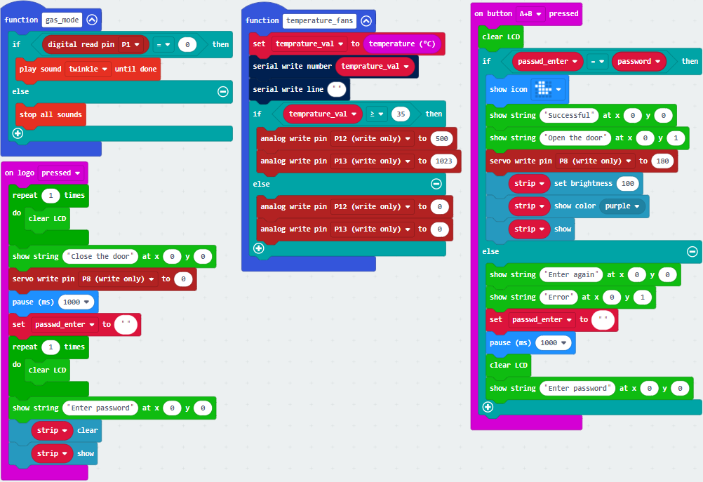

**Test Results:**

When you are close to the PIR motion sensor, the yellow LED will be on;
otherwise, the yellow LED will be off.

When dropping water onto the steam sensor and analog signal is more than 300,
the window will be close; when the analog signal is less than 300, the window
will be on.

The password can be set by the button A and B on the micro:bit board.

Pressing A and B respectively means‘.’and‘-’.

Pressing A and B simultaneously indicates“confirm”

The 5\*5 LED lights will show 
picture and the I2C1602LCD will display “Successful”and“Open the door”, the 6812
2x2 RGB will show purple color. However, if the password is wrong, “error” will
pop up on the LCD module and show “Enter password”

Touch the logo area of the micro:bit, the 1602LCD will show“Close the
door”and“Enter password”. Next, the door will be closed and the 6812 module will
be off.

When the temperature sensor on the micro:bit detects the temperature higher than
or equal to 30℃ , the small fan will rotate

## Project 17：BT-controlled LED

**(1)Project Introduction**

We control LED on and off via app.

**2.Preparation：**

**Install App**

Android system：

Search IoT microbit on Google play, or install the app package we provide(in the
Android APK folder)

iOS system: search IoT microbit in the App store, as shown
below: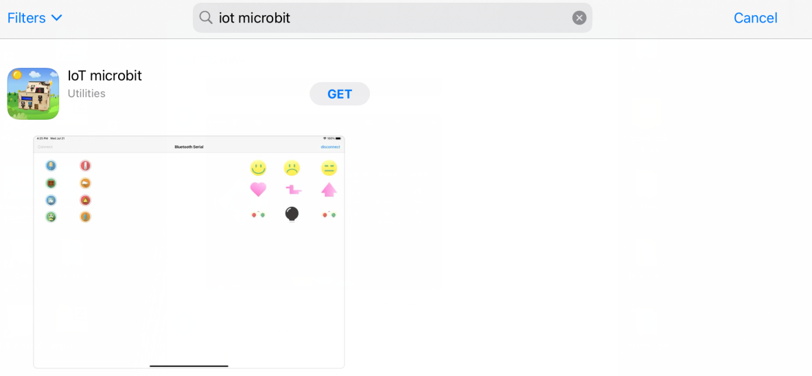

Add the BT library file as shown below:

**3. Test Code:**

Note: after finishing code, you need to enable “No paring Required: Anyone can
connect via Bluetooth”

**4.Test Results:**

Upload code to the micro:bit, open the switch of the smart home, enable the App
and click **Connect**

Search the Bluetooth name of micro:bit board

After connecting well, click LED icon

Then you will see LED on. If you click this icon again, LED will be off.

## Project 18：Smart Home

**(1)Project Introduction**

In this section, we will control the smart home via Bluetooth

**(2) Preparation：**

Download this app first.

Add the Bluetooth library file.

Add the libraries：https://github.com/keyestudio2019/ks_IoT

1.  **Test Code:**

**Seen in the folder**

1.  **Test Results:**

Burn the code to the micro:bit, turn on the switch of the smart home model, and
enable the Bluetooth of your device and app.

The password can be set by the button A and B on the micro:bit board.

Pressing A and B respectively means‘.’and‘-’.

Pressing A and B simultaneously indicates“confirm”

The 5\*5 LED lights will show 
picture and the I2C1602LCD will display“Successful” and“Open the door”, the 6812
2x2 RGB will show purple color. However, if the password is wrong, “error” will
pop up on the LCD module and “Enter password”will appear.

You can touch the logo of the micro:bit to close the door.

**9.Resources:**

https://fs.keyestudio.com/KS4027-4028

# 
